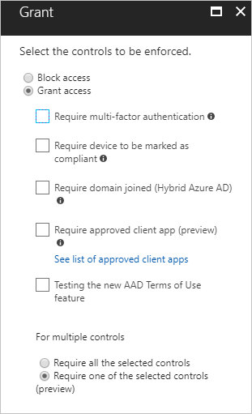
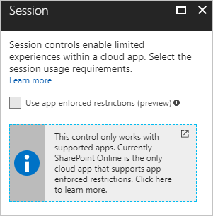
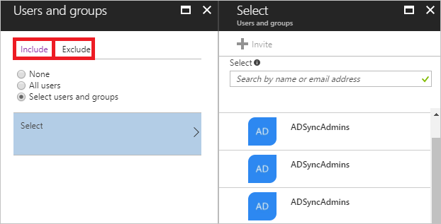
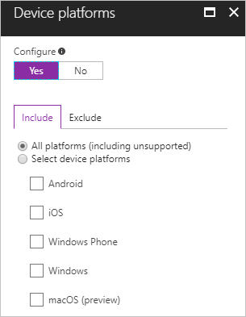
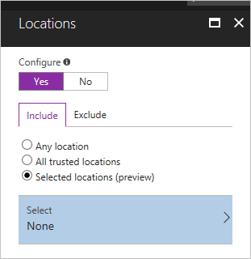

# Conditional access in Azure Active Directory

In a mobile-first, cloud-first world, Azure Active Directory enables single sign-on to devices, apps, and services from anywhere. With the proliferation of devices (including BYOD), work off corporate networks, and 3rd party SaaS apps, IT professionals are faced with two opposing goals:

- Empower the end users to be productive wherever and whenever
- Protect the corporate assets at any time

To improve productivity, Azure Active Directory provides your users with a broad range of options to access your corporate assets. With application access management, Azure Active Directory enables you to ensure that only *the right people* can access your applications. What if you want to have more control over how the right people are accessing your resources under certain conditions? What if you even have conditions under which you want to block access to certain apps even for the *right people*? For example, it might be OK for you if the right people are accessing certain apps from a trusted network; however, you might not want them to access these apps from a network you don't trust. You can address these questions using conditional access.

Conditional access is a capability of Azure Active Directory that enables you to enforce controls on the access to apps in your environment based on specific conditions. With controls, you can either tie additional requirements to the access or you can block it. The implementation of conditional access is based on policies. A policy-based approach simplifies your configuration experience because it follows the way you think about your access requirements.  

Typically, you define your access requirements using statements that are based on the following pattern:

When you replace the two occurrences of “*this*” with real-world information, you have an example for a policy statement that probably looks familiar to you:

*When contractors are trying to access our cloud apps from networks that are not trusted, then block access.*

The policy statement above highlights the power of conditional access. While you can enable contractors to basically access your cloud apps (**who**), with conditional access, you can also define conditions under which the access is possible (**how**).

In the context of Azure Active Directory conditional access,

- "**When this happens**" is called **condition statement**
- "**Then do this**" is called **controls**

The combination of a condition statement with your controls represents a conditional access policy.

## Controls

In a conditional access policy, controls define what it is that should happen when a condition statement has been satisfied.  
With controls, you can either block access or allow access with additional requirements.
When you configure a policy that allows access, you need to select at least one requirement.  

There are two types of controls: 

- **Grant controls** - Grant controls govern whether or not a user can complete authentication and reach the resource that they’re attempting to sign-in to. If you have multiple controls selected, you can configure whether all of them are required when your policy is processed.
The current implementation of Azure Active Directory enables you to configure the following grant control requirements:

    

- **Session controls** - Session controls enable limiting experience within a cloud app. The session controls are enforced by cloud apps and rely on additional information provided by Azure AD to the app about the session.

    

For more information, see [controls in Azure Active Directory Conditional Access](active-directory-conditional-access-controls.md).

## Condition Statement

The previous section has introduced you to supported options to block or restrict access to your resources in form of controls. In a conditional access policy, you define the criteria that need to be met for your controls to be applied in form of a condition statement.  

You can include the following assignments into your condition statement:

### Who?

When you configure a conditional access policy, you need to select the users or groups your policy applies to. 
In many cases, you want your controls to be applied to a specific set of users. In a condition statement, you can define this set by selecting the required users and groups your policy applies to. If necessary, you can also explicitly exclude a set of users from your policy by exempting them.  

### What?

When you configure a conditional access policy, you need to select the cloud apps your policy applies to.
Typically, there are certain apps in your environment requiring, from a protection perspective, more attention than others. This affects, for example, apps that have access to sensitive data.
By selecting cloud apps, you define the scope of cloud apps your policy applies to. If necessary, you can also explicitly exclude a set of apps from your policy.

For a complete list of the cloud apps you can use in your conditional access policy, see the [Azure Active Directory Conditional Access technical reference](active-directory-conditional-access-technical-reference.md#cloud-apps-assignments).

### How?

As long as access to your apps is performed under conditions you can control, there might be no need for imposing additional controls on how your cloud apps are accessed by your users. However, things might look different if access to your cloud apps is performed, for example, from networks that are not trusted or devices that are not compliant. In a condition statement, you can define certain access conditions that have additional requirements for how access to your apps is performed.

## Conditions

In the current implementation of Azure Active Directory, you can define conditions for the following areas:

- Sign-in risk
- Device platforms
- Locations
- Client apps

### Sign-in risk

A sign-in risk is an object that is used by Azure Active Directory to track the likelihood that a sign-in attempt was not performed by the legitimate owner of a user account. In this object, the likelihood 
(High, Medium, or Low) is stored in form of an attribute called [sign-in risk level](active-directory-reporting-risk-events.md#risk-level). This object is generated during a sign-in of a user if sign-in risks have been detected by Azure Active Directory. For more information, see [Risky sign-ins](active-directory-identityprotection.md#risky-sign-ins).  
You can use the calculated sign-in risk level as condition in a conditional access policy. 

### Device platforms

The device platform is characterized by the operating system that is running on your device:

- Android
- iOS
- Windows Phone
- Windows
- macOS (preview). 

You can define the device platforms that are included as well as device platforms that are exempted from a policy.  
To use device platforms in the policy, first change the configure toggles to **Yes**, and then select all or individual device platforms the policy applies to. If you select individual device platforms, the policy has only an impact on these platforms. In this case, sign-ins to other supported platforms are not impacted by the policy.

### Locations

With locations, you have the option to define conditions that are based on where a connection attempt was initiated from. The entries in the locations list are either **named locations** or **MFA trusted IPs**.  

**Named locations** is a feature of Azure Active Directory that allows you to define labels for the locations connection attempts were made from. To define a location, you can either configure an IP address ranges or you select a country / region.  

Additionally, you can mark a named location as trusted location. For a conditional access policy, the trusted location is another filter option that enables you to select *All trusted locations* in your locations condition.
Named locations are also important in the context of the detection of [risk events](active-directory-reporting-risk-events.md) to reduce the number of false-positives for the impossible travel to atypical locations risk event. 

The number of named locations you can configure is constrained by the size of the related object in Azure AD. You can configure:
 
 - One named location with up to 500 IP ranges
 - A maximum of 60 named locations (preview) with one IP range assigned to each of them 

For more information, see [named locations in Azure Active Directory](active-directory-named-locations.md).

**MFA trusted IPs** is a feature of multi-factor authentication that enables you to define trusted IP address ranges representing your organization's local intranet. When you configure a location condition, Trusted IPs enables you to distinguish between connections made from your organization's network and all other locations. For more information, see [trusted IPs](../multi-factor-authentication/multi-factor-authentication-whats-next.md#trusted-ips).  

In your conditional access policy, you can:

- Include
    - Any location
    - All trusted locations
    - Selected locations
- Exclude
    - All trusted locations
    - Selected locations
     

### Client apps

The client app can be either on a generic level the app (web browser, mobile app, desktop client) you have used to connect to Azure Active Directory or you can specifically select Exchange Active Sync.  
Legacy authentication refers to clients using basic authentication such as older Office clients that don’t use modern authentication. Conditional access is currently not supported with legacy authentication.

For a complete list of the client apps you can use in your conditional access policy, see the [Azure Active Directory Conditional Access technical reference](active-directory-conditional-access-technical-reference.md#client-apps-condition).

## Common scenarios

### Requiring multi-factor authentication for apps

Many environments have apps requiring a higher level of protection than the others.
This is, for example, the case for apps that have access to sensitive data.
If you want to add another layer of protection to these apps, you can configure a conditional access policy that requires multi-factor authentication when users are accessing these apps.

### Requiring multi-factor authentication for access from networks that are not trusted

This scenario is similar to the previous scenario because it adds a requirement for multi-factor authentication.
However, the main difference is the condition for this requirement.  
While the focus of the previous scenario was on apps with access to sensitve data, the focus of this scenario is on trusted locations.  
In other words, you might have a requirement for multi-factor authentication if an app is accessed by a user from a network you don't trust.

### Only trusted devices can access Office 365 services

If you are using Intune in your environment, you can immediately start using the conditional access policy interface in the Azure console.

Many Intune customers are using conditional access to ensure that only trusted devices can access Office 365 services. This means that mobile devices are enrolled with Intune and meet compliance policy requirements, and that Windows PCs are joined to an on-premises domain. A key improvement is that you do not have to set the same policy for each of the Office 365 services.  When you create a new policy, configure the Cloud apps to include each of the O365 apps that you wish to protect with Conditional Access.

## Next steps

- If you want to know how to configure a conditional access policy, see [Get started with conditional access in Azure Active Directory](active-directory-conditional-access-azure-portal-get-started.md).

- If you are ready to configure conditional access policies for your environment, see the [best practices for conditional access in Azure Active Directory](active-directory-conditional-access-best-practices.md). 
