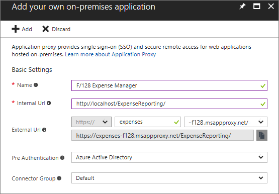
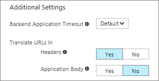
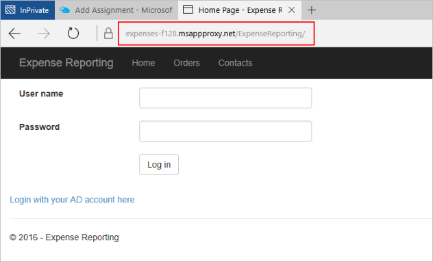

# Publish applications using Azure AD Application Proxy

> [!div class="op_single_selector"]
> * [Azure portal](application-proxy-publish-azure-portal.md)
> * [Azure classic portal](active-directory-application-proxy-publish.md)

Azure Active Directory (AD) Application Proxy helps you support remote workers by publishing on-premises applications to be accessed over the internet. You can publish these applications through the Azure portal to provide secure remote access from outside your network.

This article walks you through the steps to publish an on-premises app with Application Proxy. After you complete this article, your users will be able to access your app remotely. And you'll be ready to configure extra features for the application like single sign-on, personalized information, and security requirements.

If you're new to Application Proxy, learn more about this feature with the article [How to provide secure remote access to on-premises applications](active-directory-application-proxy-get-started.md).

## Publish an on-premises app for remote access

Follow these steps to publish your apps with Application Proxy. If you haven't already downloaded and configured a connector for your organization, go to [Get started with Application Proxy and install the connector](active-directory-application-proxy-enable.md) first, and then publish your app.

> [!TIP]
> If you're testing out Application Proxy for the first time, choose an application that's set up for password-based authentication. Application Proxy supports other types of authentication, but password-based apps are the easiest to get up and running quickly. 

1. Sign in as an administrator in the [Azure portal](https://portal.azure.com/).
2. Select **Azure Active Directory** > **Enterprise applications** > **New application**.

  

3. Select **All**, then select **On-premises application**.  

  

4. Provide the following information about your application:

   - **Name**: The name of the application that will appear on the access panel and in the Azure portal. 

   - **Internal URL**: The URL that you use to access the application from inside your private network. You can provide a specific path on the backend server to publish, while the rest of the server is unpublished. In this way, you can publish different sites on the same server as different apps, and give each one its own name and access rules.

     > [!TIP]
     > If you publish a path, make sure that it includes all the necessary images, scripts, and style sheets for your application. For example, if your app is at https://yourapp/app and uses images located at https://yourapp/media, then you should publish https://yourapp/ as the path. This internal URL doesn't have to be the landing page your users see. For more information, see [Set a custom home page for published apps](application-proxy-office365-app-launcher.md).

   - **External URL**: The address your users will go to in order to access the app from outside your network. If you don't want to use the default Application Proxy domain, read about [custom domains in Azure AD Application Proxy](active-directory-application-proxy-custom-domains.md).
   - **Pre Authentication**: How Application Proxy verifies users before giving them access to your application. 

     - Azure Active Directory: Application Proxy redirects users to sign in with Azure AD, which authenticates their permissions for the directory and application. We recommend keeping this option as the default, so that you can take advantage of Azure AD security features like conditional access and Multi-Factor Authentication.
     - Passthrough: Users don't have to authenticate against Azure Active Directory to access the application. You can still set up authentication requirements on the backend.
   - **Connector Group**: Connectors process the remote access to your application, and connector groups help you organize connectors and apps by region, network, or purpose. If you don't have any connector groups created yet, your app is assigned to **Default**.

   
5. If necessary, configure additional settings. For most applications, you should keep these settings in their default states. 
   - **Backend Application Timeout**: Set this value to **Long** only if your application is slow to authenticate and connect. 
   - **Translate URLs in Headers**: Keep this value as **Yes** unless your application required the original host header in the authentication request.
   - **Translate URLs in Application Body**: Keep this value as **No** unless you have hardcoded HTML links to other on-premises applications, and don't use custom domains. For more information, see [Link translation with Application Proxy](application-proxy-link-translation.md).
   
   

6. Select **Add**.

## Add a test user 

To test that your app was published correctly, add a test user account. Verify that this account already has permissions to access the app from inside the corporate network.

1. Back on the Quick start blade, select **Assign a user for testing**.

  

2. On the Users and groups blade, select **Add**.

  

3. On the Add assignment blade, select **Users and groups** then choose the account you want to add. 
4. Select **Assign**.

## Test your published app

In your browser, navigate to the external URL that you configured during the publish step. You should see the start screen, and be able to sign in with the test account you set up.

## Next steps
- [Download connectors](active-directory-application-proxy-enable.md) and [create connector groups](active-directory-application-proxy-connectors-azure-portal.md) to publish applications on separate networks and locations.

- [Set up single sign-on](application-proxy-sso-azure-portal.md) for your newly published app
