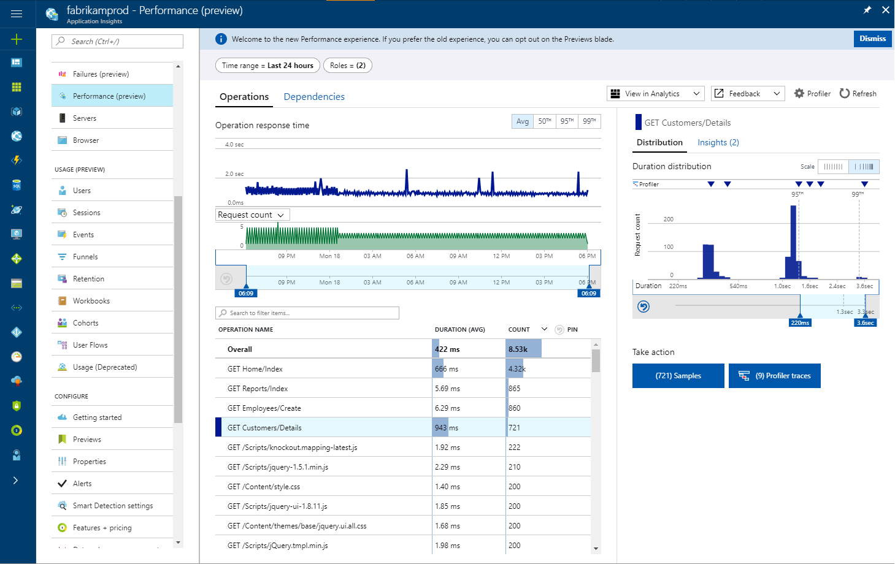
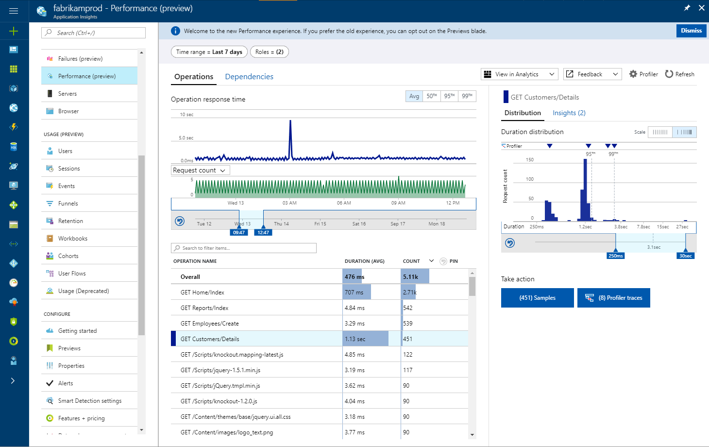
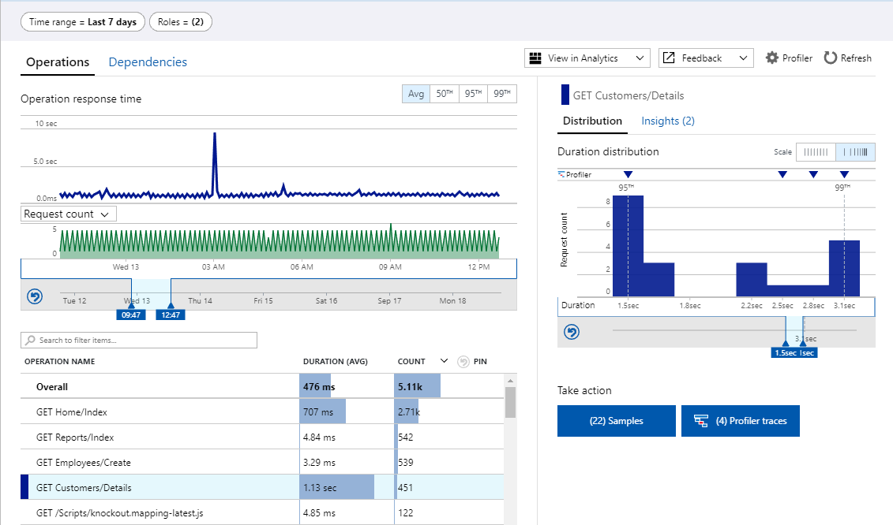
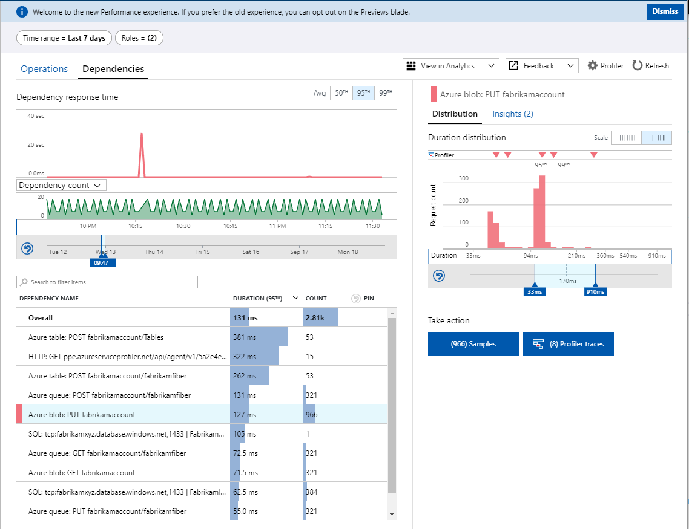
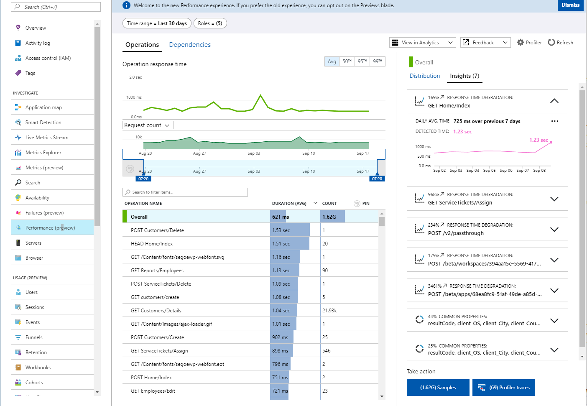

# Monitor performance in web applications

Make sure your application is performing well, and find out quickly about any failures. [Application Insights][start] will tell you about any performance issues and exceptions, and help you find and diagnose the root causes.

Application Insights can monitor both Java and ASP.NET web applications and services, WCF services. They can be hosted on-premises, on virtual machines, or as Microsoft Azure websites. 

On the client side, Application Insights can take telemetry from web pages and a wide variety of devices including iOS, Android, and Windows Store apps.

>[!Note]
> We have made a new experience available for finding slow performing pages in your web application. If you don't have access to it, enable it by configuring your preview options with the [Preview blade](app-insights-previews.md). Read about this new experience in [Find and fix performance bottlenecks with the interactive Performance investigation](#Find-and-fix-performance-bottlenecks-with-an-interactive-Performance-investigation).

## Set up performance monitoring
If you haven't yet added Application Insights to your project (that is, if it doesn't have ApplicationInsights.config), choose one of these ways to get started:

* [ASP.NET web apps](app-insights-asp-net.md)
  * [Add exception monitoring](app-insights-asp-net-exceptions.md)
  * [Add dependency monitoring](app-insights-monitor-performance-live-website-now.md)
* [J2EE web apps](app-insights-java-get-started.md)
  * [Add dependency monitoring](app-insights-java-agent.md)

## Exploring performance metrics
In [the Azure portal](https://portal.azure.com), browse to the Application Insights resource that you set up for your application. The overview blade shows basic performance data:

Click any chart to see more detail, and to see results for a longer period. For example, click the Requests tile and then select a time range:

Click a chart to choose which metrics it displays, or add a new chart and select its metrics:

> [!NOTE]
> **Uncheck all the metrics** to see the full selection that is available. The metrics fall into groups; when any member of a group is selected, only the other members of that group appear.

## What does it all mean? Performance tiles and reports
There are various performance metrics you can get. Let's start with those that appear by default on the application blade.

### Requests
The number of HTTP requests received in a specified period. Compare this with the results on other reports to see how your app behaves as the load varies.

HTTP requests include all GET or POST requests for pages, data, and images.

Click on the tile to get counts for specific URLs.

### Average response time
Measures the time between a web request entering your application and the response being returned.

The points show a moving average. If there are a lot of requests, there might be some that deviate from the average without an obvious peak or dip in the graph.

Look for unusual peaks. In general, expect response time to rise with a rise in requests. If the rise is disproportionate, your app might be hitting a resource limit such as CPU or the capacity of a service it uses.

Click the tile to get times for specific URLs.

### Slowest requests

Shows which requests might need performance tuning.

### Failed requests

A count of requests that threw uncaught exceptions.

Click the tile to see the details of specific failures, and select an individual request to see its detail. 

Only a representative sample of failures is retained for individual inspection.

### Other metrics
To see what other metrics you can display, click a graph, and then deselect all the metrics to see the full available set. Click (i) to see each metric's definition.

Selecting any metric disables the others that can't appear on the same chart.

## Set alerts
To be notified by email of unusual values of any metric, add an alert. You can choose either to send the email to the account administrators, or to specific email addresses.

Set the resource before the other properties. Don't choose the webtest resources if you want to set alerts on performance or usage metrics.

Be careful to note the units in which you're asked to enter the threshold value.

*I don't see the Add Alert button.* - Is this a group account to which you have read-only access? Check with the account administrator.

## Diagnosing issues
Here are a few tips for finding and diagnosing performance issues:

* Set up [web tests][availability] to be alerted if your web site goes down or responds incorrectly or slowly. 
* Compare the Request count with other metrics to see if failures or slow response are related to load.
* [Insert and search trace statements][diagnostic] in your code to help pinpoint problems.
* Monitor your Web app in operation with [Live Metrics Stream][livestream].
* Capture the state of your .Net application with [Snapshot Debugger][snapshot].

>[!Note]
> We are in the process of transitioning Application Insights performance investigation to an interactive full-screen experience. The following documentation covers the new experience first and then reviews the previous experience, in case you still need to access it, while it remains available throughout the transition.

## Find and fix performance bottlenecks with an interactive full-screen performance investigation

You can use the new Application Insights interactive performance investigation to review slow performing operations in your Web app. You can quickly select a specific slow operation and use [Profiler](app-insights-profiler.md) to root cause the slow operations down to code. Using the new duration distribution shown for the selected operation you can quickly at a glance assess just how bad the experience is for your customers. In fact, for each slow operation you can see how many of your user interactions were impacted. In the following example, we've decided to take a closer look at the experience for GET Customers/Details operation. In the duration distribution we can see that there are three spikes. Leftmost spike is around 400ms and represents great responsive experience. Middle spike is around 1.2s and represents a mediocre experience. Finally at the 3.6s we have another small spike that represents the 99th percentile experience, which is likely to cause our customers to leave dissatisfied. That experience is ten times slower than the great experience for the same operation. 

To get a better sense of the user experiences for this operation, we can select a larger time range. We can then also narrow down in time on a specific time window where the operation was particularly slow. In the following example we've switched from the default 24 hours time range to the 7 days time range and then zoomed into the 9:47 to 12:47 time window between Tue the 12th and Wed the 13th. Note that both the duration distribution and the number of sample and profiler traces have been updated on the right.

To narrow in on the slow experiences, we next zoom into the durations that fall between 95th and the 99th percentile. These represent the 4% of user interactions that were particularly slow.

We can now either look at the representative samples, by clicking on the Samples button, or at the representative profiler traces, by clicking on the Profiler traces button. In this example there are four traces that have been collected for GET Customers/Details in the time window and range duration of interest.

Sometimes the issue will not be in your code, but rather in a dependency you code calls. You can switch to the Dependencies tab in the performance triage view to investigate such slow dependencies. Note that by default the performance view is trending averages, but what you really want to look at is the 95th percentile (or the 99th, in case you are monitoring a very mature service). In the following example we have focused on the slow Azure BLOB dependency, where we call PUT fabrikamaccount. The good experiences cluster around 40ms, while the slow calls to the same dependency are three times slower, clustering around 120ms. It doesn't take many of these calls to add up to cause the respective operation to noticeably slow down. You can drill into the representative samples and profiler traces, just like you can with the Operations tab.

Another really powerful feature that is new to the interactive full-screen performance investigation is the integration with insights. Application Insights can detect and surface as insights responsiveness regressions as well as help you identify common properties in the sample set you decided to focus on. The best way to look at all of the available insights is to switch to a 30 days time range and then select Overall to see insights across all operations for the past month.

Application Insights in the new performance triage view can literally help you find the needles in the haystack that result in poor experiences for your Web app users.

## Deprecated: Find and fix performance bottlenecks with a narrow bladed legacy performance investigation

You can use the legacy Application Insights bladed performance investigation to locate areas of your Web app that are slowing down overall performance. You can find specific pages that are slowing down, and use the [Profiler](app-insights-profiler.md) to trace the root cause of these issues down to code. 

### Create a list of slow performing pages 

The first step for finding performance issues is to get a list of the slow responding pages. The screen shot below demonstrates using the Performance blade to get a list of potential pages to investigate further. You can quickly see from this page that there was a slow-down in the response time of the app at approximately 6:00 PM and again at approximately 10 PM. You can also see that the GET customer/details operation had some long running operations with a median response time of 507.05 milliseconds. 

### Drill down on specific pages

Once you have a snapshot of your app's performance, you can get more details on specific slow-performing operations. Click on any operation in the list to see the details as shown below. From the chart you can see if the performance was based on a dependency. You can also see how many users experienced the various response times. 

### Drill down on a specific time period

After you have identified a point in time to investigate, drill down even further to look at the specific operations that might have caused the performance slow-down. When you click on a specific point in time you get the details of the page as shown below. In the example below you can see the operations listed for a given time period along with the server response codes and the operation duration. You also have the url for opening a TFS work item if you need to send this information to your development team.

### Drill down on a specific operation

After you have identified a point in time to investigate, drill down even further to look at the specific operations that might have caused the performance slow-down. Click on an operation from the list to see the details of the operation as shown below. In this example you can see that the operation failed, and Application Insights has provided the details of the exception the application threw. Again, you can easily create a TFS work item from this blade.

## Next steps
[Web tests][availability] - Have web requests sent to your application at regular intervals from around the world.

[Capture and search diagnostic traces][diagnostic] - Insert trace calls and sift through the results to pinpoint issues.

[Usage tracking][usage] - Find out how people use your application.

[Troubleshooting][qna] - and Q & A

<!--Link references-->

[availability]: app-insights-monitor-web-app-availability.md
[diagnostic]: app-insights-diagnostic-search.md
[greenbrown]: app-insights-asp-net.md
[qna]: app-insights-troubleshoot-faq.md
[redfield]: app-insights-monitor-performance-live-website-now.md
[start]: app-insights-overview.md
[usage]: app-insights-web-track-usage.md
[livestream]: app-insights-live-stream.md
[snapshot]: app-insights-snapshot-debugger.md

