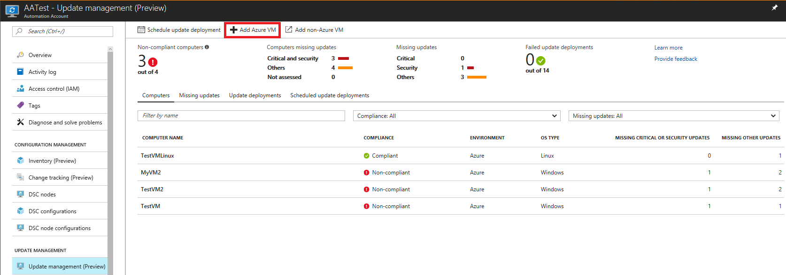
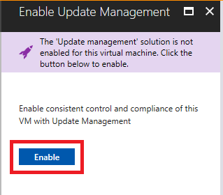
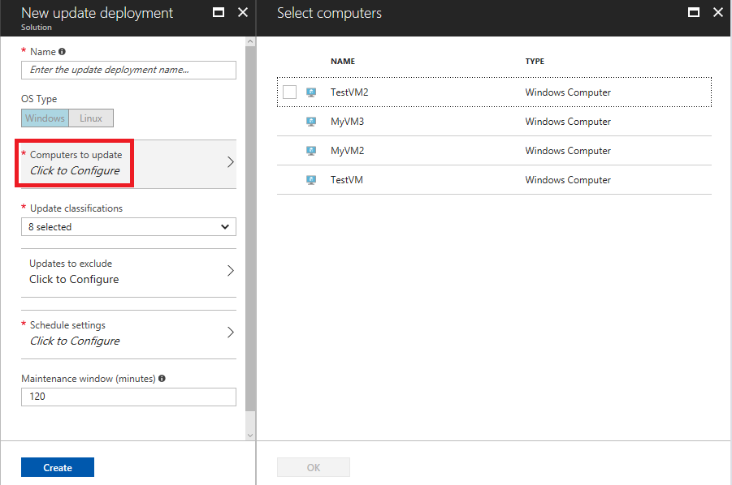
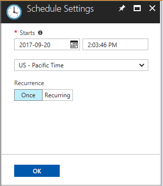

# Manage updates for multiple Azure virtual machines

Update management allows you to manage updates and patches for your Azure virtual machines.
From your [Azure Automation](automation-offering-get-started.md) account, you can quickly onboard virtual machines, assess the status of available updates, schedule installation of required updates, and review deployment results to verify updates were applied successfully to all virtual machines for which
Update management is enabled.

## Prerequisites

To complete the steps in this guide, you will need:

* An Azure Automation account. For instructions on creating an Azure Automation Run As account, see [Azure Run As Account](automation-sec-configure-azure-runas-account.md).
* An Azure Resource Manager virtual machine (not Classic). For instructions on creating a VM, see 
  [Create your first Windows virtual machine in the Azure portal](../virtual-machines/virtual-machines-windows-hero-tutorial.md)

## Enable update management for Azure virtual machines

1. In the Azure portal, open the Automation account.
2. On the left-hand side of the screen, select **Update management**.
3. At the top of the screen, click **Add Azure VM**.
    
4. Select a virtual machine to oboard. The **Enable Update Management** screen appears.
5. Click **Enable**.

   

Update management is enabled for your virtual machine.

## View update assessment

After **Update management** is enabled, the **Update management** screen appears. You can see a list of missing updates on the **Missing updates** tab.

## Schedule an update deployment

To install updates, schedule a deployment that follows your release schedule and service window.
You can choose which update types to include in the deployment. For example you can include critical or security updates and exclude update rollups.

Schedule a new Update Deployment for one or more virtual machines by clicking **Schedule update deployment** at the top of the **Update management** screen. 
In the **New update deployment** screen, specify the following:

* **Name** - Provide a unique name to identify the update deployment.
* **OS Type** - Select Windows or Linux.
* **Computers to update** - Select the virtual machines you want to update.

  

* **Update classification** - Select the types of software the update deployment will include in the deployment. The classification types are:
  * Critical updates
  * Security updates
  * Update rollups
  * Feature packs
  * Service packs
  * Definition updates
  * Tools
  * Updates
* **Schedule settings** - You can either accept the default date and time, which is 30 minutes after current time, or specify a different time.
   You can also specify whether the deployment occurs once or set up a recurring schedule. Click the Recurring option under Recurrence to set up a recurring schedule.

   

* **Maintenance window (minutes)** - Specify the period of time you want the update deployment to occur within.  This helps ensure changes are performed within your defined service windows.

After you have completed configuring the schedule, click **Create** button and you return to the status dashboard.
Notice that the **Scheduled** table shows the deployment schedule you just created.

> [!WARNING]
> For updates that require a reboot, the virtual machine will be restarted automatically.

## View results of an update deployment

After the scheduled deployment is started, you can see the status for that deployment on the **Update deployments** tab on the **Update management** screen.
If it is currently running, it's status shows as **In progress**. After it completes, if successful, it changes to **Succeeded**.
If there is a failure with one or more updates in the deployment, the status is **Partially failed**.

Click the completed update deployment to see the dashboard for that update deployment.

In **Update results** tile is a summary of the total number of updates and deployment results on the virtual machine.
In the table to the right is a detailed breakdown of each update and the installation results, which could be one of the following values:

* Not attempted - the update was not installed because there was insufficient time available based on the maintenance window duration defined.
* Succeeded - the update succeeded
* Failed - the update failed

Click **All logs** to see all log entries that the deployment created.

Click the **Output** tile to see job stream of the runbook responsible for managing the update deployment on the target virtual machine.

Click **Errors** to see detailed information about any errors from the deployment.

## Next steps

* To learn more about Update management, see [Update Management](../operations-management-suite/oms-solution-update-management.md).