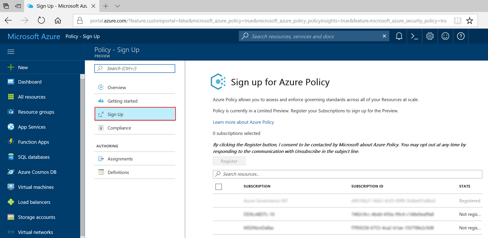
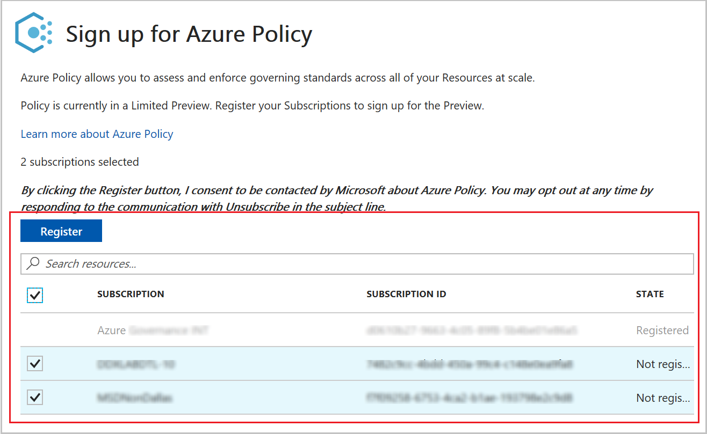

# Create a policy assignment to identify non-compliant resources in your Azure environment with the Azure CLI

The first step in understanding compliance in Azure is knowing where you stand with your current resources. This quickstart steps you through the process of creating a policy assignment to identify non-compliant resources with the policy definition – *Require SQL Server version 12.0*. At the end of this process, you will have successfully identified what servers are of a different version, essentially non-compliant.

The Azure CLI is used to create and manage Azure resources from the command line or in scripts. This guide details using the Azure CLI to create a policy assignment to identify non-compliant resources in your Azure Environment.

If you don't have an Azure subscription, create a [free](https://azure.microsoft.com/free/) account before you begin.

[!INCLUDE [cloud-shell-try-it.md](../../includes/cloud-shell-try-it.md)]

If you choose to install and use the CLI locally, this quickstart requires that you are running the Azure CLI version 2.0.4 or later. Run `az --version` to find the version. If you need to install or upgrade, see [Install Azure CLI 2.0]( /cli/azure/install-azure-cli).
 
## Opt in to Azure Policy

Azure Policy is now available in Limited Preview, so you need to register to request access.

1. Go to Azure Policy at https://aka.ms/getpolicy and select **Sign Up** in the left pane.

   

2. Opt in to Azure Policy by selecting the subscriptions in the **Subscription** list you would like to work with. Then select **Register**.

   

   It may take a couple of days for us to accept your registration request, based on demand. Once your request gets accepted, you are notified via email that you can begin using the service.

## Create a policy assignment

In this quickstart, we create a policy assignment and assign the Require SQL Server Version 12.0 definition. This policy definition identifies resources that do not comply with the conditions set in the policy definition.

Follow these steps to create a new policy assignment.

View all policy definitions, and find the “Require SQL Server version 12.0” policy definition:

```azurecli
az policy definition list
```

Azure Policy comes with already built in policy definitions you can use. You will see built-in policy definitions such as:

- Enforce tag and its value
- Apply tag and its value
- Require SQL Server Version 12.0

Next, provide the following information and run the following command to assign the policy definition:

- Display **Name** for the policy assignment. In this case, let’s use *Require SQL Server version 12.0 Assignment*.
- **Policy** – This is the policy definition, based off which you’re using to create the assignment. In this case, it is the policy definition – *Require SQL Server version 12.0*
- A **scope** - A scope determines what resources or grouping of resources the policy assignment gets enforced on. It could range from a subscription to resource groups.

  Use the subscription (or resource group) you have previously registered when you opted into Azure Policy, in this example we are using this subscription ID - **bc75htn-a0fhsi-349b-56gh-4fghti-f84852** and the resource group name - **FabrikamOMS**. Be sure to change these to the ID of the subscription and the name of resource group you are working with. 

This is what the command should look like:

```azurecli
az policy assignment create --name Require SQL Server version 12.0 Assignment --policy Require SQL Server version 12.0 --scope /subscriptions/ 
bc75htn-a0fhsi-349b-56gh-4fghti-f84852/resourceGroups/FabrikamOMS
```

A policy assignment is a policy that has been assigned to take place within a specific scope. This scope could also range from a management group to a resource group.

## Identify non-compliant resources

To view the resources that are not compliant under this new assignment:

1. Navigate back to the Azure Policy page.
2. Select **Compliance** on the left pane, and search for the **Policy Assignment** you created.

   

   If there are any existing resources that are not compliant with this new assignment, they show up under the **Non-compliant resources** tab, as shown above.

## Clean up resources

Other guides in this collection build upon this quickstart. If you plan to continue to work with subsequent tutorials, do not clean up the resources created in this quickstart. If you do not plan to continue, delete the assignment you created by running this command:

```azurecli
az policy assignment delete –name Require SQL Server version 12.0 Assignment --scope /subscriptions/ bc75htn-a0fhsi-349b-56gh-4fghti-f84852 resourceGroups/ FabrikamOMS
```

## Next steps

In this quickstart, you assigned a policy definition to identify non-compliant resources in your Azure environment.

To learn more about assigning policies, to ensure that resources you create in the **future** are compliant, continue to the tutorial for:

> [!div class="nextstepaction"]
> [Creating and managing policies](./create-manage-policy.md)

