# Full CI/CD pipeline to deploy a multi-container application on Azure Container Service with ACS Engine and Docker Swarm Mode using Visual Studio Team Services

*This article is based on 
[Full CI/CD pipeline to deploy a multi-container application on Azure Container Service with Docker Swarm using Visual Studio Team Services](container-service-docker-swarm-setup-ci-cd.md) documentation*

Nowadays, One of the biggest challenges when developing modern applications for the cloud is being able to deliver these applications continuously. In this article, you learn how to implement a full continuous integration and deployment (CI/CD) pipeline using: 
* Azure Container Service Engine with Docker Swarm Mode
* Azure Container Registry
* Visual Studio Team Services

This article is based on a simple application, available on [GitHub](https://github.com/jcorioland/MyShop/tree/docker-linux), developed with ASP.NET Core. The application is composed of four different services: three web APIs and one web front end:

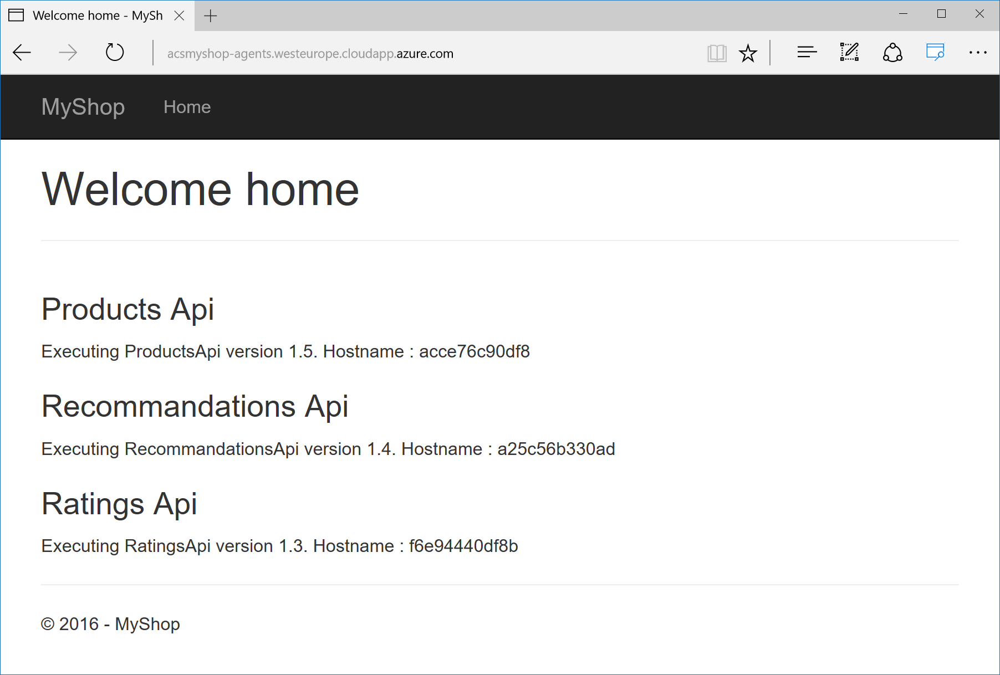

The objective is to deliver this application continuously in a Docker Swarm Mode cluster, using Visual Studio Team Services. The following figure details this continuous delivery pipeline:

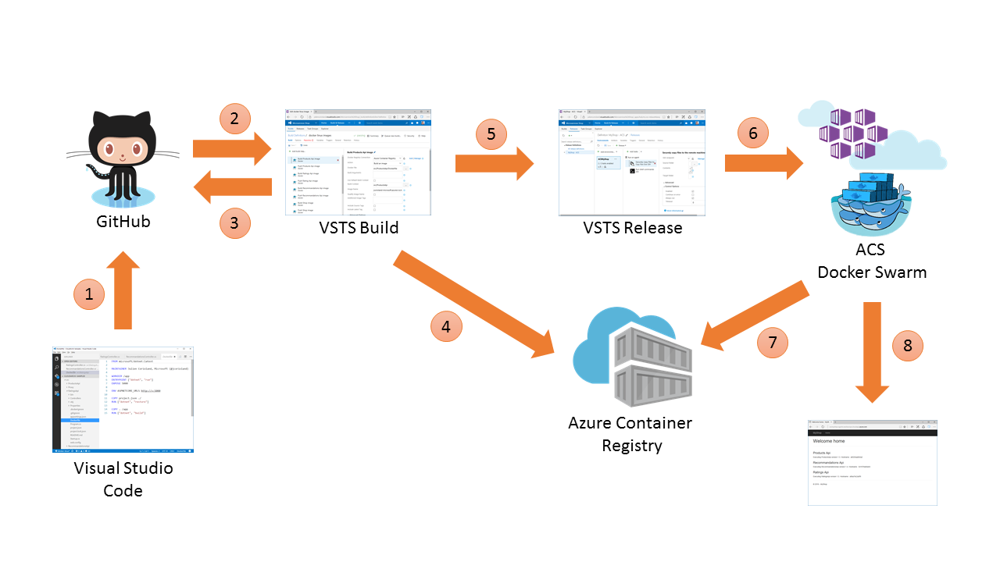

Here is a brief explanation of the steps:

1. Code changes are committed to the source code repository (here, GitHub) 
2. GitHub triggers a build in Visual Studio Team Services 
3. Visual Studio Team Services gets the latest version of the sources and builds all the images that compose the application 
4. Visual Studio Team Services pushes each image to a Docker registry created using the Azure Container Registry service 
5. Visual Studio Team Services triggers a new release 
6. The release runs some commands using SSH on the Azure container service cluster master node 
7. Docker Swarm Mode on the cluster pulls the latest version of the images 
8. The new version of the application is deployed using Docker Stack 

## Prerequisites

Before starting this tutorial, you need to complete the following tasks:

- [Create a Swarm Mode cluster in Azure Container Service with ACS Engine](https://github.com/Azure/azure-quickstart-templates/tree/master/101-acsengine-swarmmode)
- [Connect with the Swarm cluster in Azure Container Service](../container-service-connect.md)
- [Create an Azure container registry](../../container-registry/container-registry-get-started-portal.md)
- [Have a Visual Studio Team Services account and team project created](https://www.visualstudio.com/en-us/docs/setup-admin/team-services/sign-up-for-visual-studio-team-services)
- [Fork the GitHub repository to your GitHub account](https://github.com/jcorioland/MyShop/tree/docker-linux)

>[!NOTE]
> The Docker Swarm orchestrator in Azure Container Service uses legacy standalone Swarm. Currently, the integrated [Swarm mode](https://docs.docker.com/engine/swarm/) (in Docker 1.12 and higher) is not a supported orchestrator in Azure Container Service. For this reason, we are using [ACS Engine](https://github.com/Azure/acs-engine/blob/master/docs/swarmmode.md), a community-contributed [quickstart template](https://azure.microsoft.com/resources/templates/101-acsengine-swarmmode/), or a Docker solution in the [Azure Marketplace](https://azuremarketplace.microsoft.com).
>

## Step 1: Configure your Visual Studio Team Services account 

In this section, you configure your Visual Studio Team Services account. To configure VSTS Services Endpoints, in your Visual Studio Team Services project, click the **Settings** icon in the toolbar, and select **Services**.


### Connect Visual Studio Team Services and Azure account

Set up a connection between your VSTS project and your Azure account.

1. On the left, click **New Service Endpoint** > **Azure Resource Manager**.
2. To authorize VSTS to work with your Azure account, select your **Subscription** and click **OK**.

    

### Connect Visual Studio Team Services and GitHub

Set up a connection between your VSTS project and your GitHub account.

1. On the left, click **New Service Endpoint** > **GitHub**.
2. To authorize VSTS to work with your GitHub account, click **Authorize** and follow the procedure in the window that opens.

    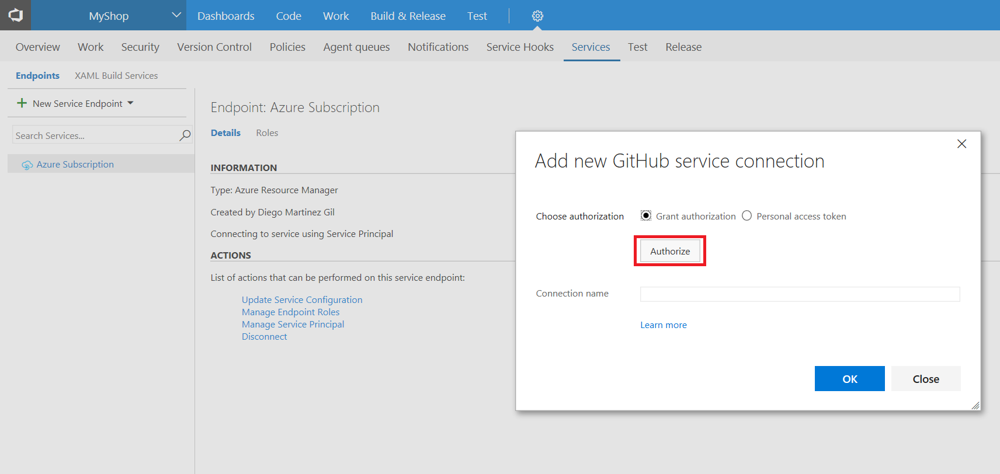

### Connect VSTS to your Azure Container Service cluster

The last steps before getting into the CI/CD pipeline are to configure external connections to your Docker Swarm cluster in Azure. 

1. For the Docker Swarm cluster, add an endpoint of type **SSH**. Then enter the SSH connection information of your Swarm cluster (master node).

    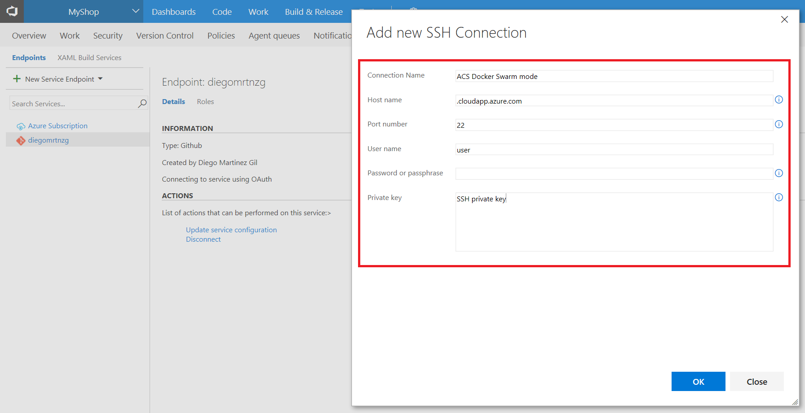

All the configuration is done now. In the next steps, you create the CI/CD pipeline that builds and deploys the application to the Docker Swarm cluster. 

## Step 2: Create the build definition

In this step, you set up a build definition for your VSTS project and define the build workflow for your container images

### Initial definition setup

1. To create a build definition, connect to your Visual Studio Team Services project and click **Build & Release**. In the **Build definitions** section, click **+ New**. 

    

2. Select the **Empty process**.

    

4. Then, click the **Variables** tab and create two new variables: **RegistryURL** and **AgentURL**. Paste the values of your Registry and Cluster Agents DNS.

    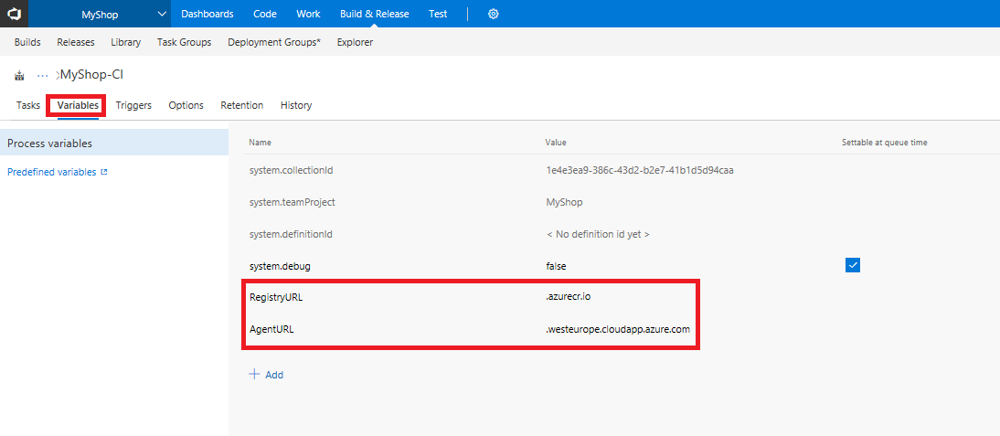

5. On the **Build Definitions** page, open the **Triggers** tab and configure the build to use continuous integration with the fork of the MyShop project that you created in the prerequisites. Then, select **Batch changes**. Make sure that you select *docker-linux* as the **Branch specification**.

    


6. Finally, click the **Options** tab and configure the Default agent queue to **Hosted Linux Preview**.

    

### Define the build workflow
The next steps define the build workflow. First, you need to configure the source of the code. To do it, select **GitHub** and your **repository** and **branch** (docker-linux).

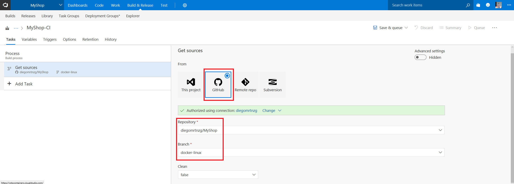

There are five container images to build for the *MyShop* application. Each image is built using the Dockerfile located in the project folders:

* ProductsApi
* Proxy
* RatingsApi
* RecommandationsApi
* ShopFront

You need two Docker steps for each image, one to build the image, and one to push the image in the Azure container registry. 

1. To add a step in the build workflow, click **+ Add build step** and select **Docker**.

    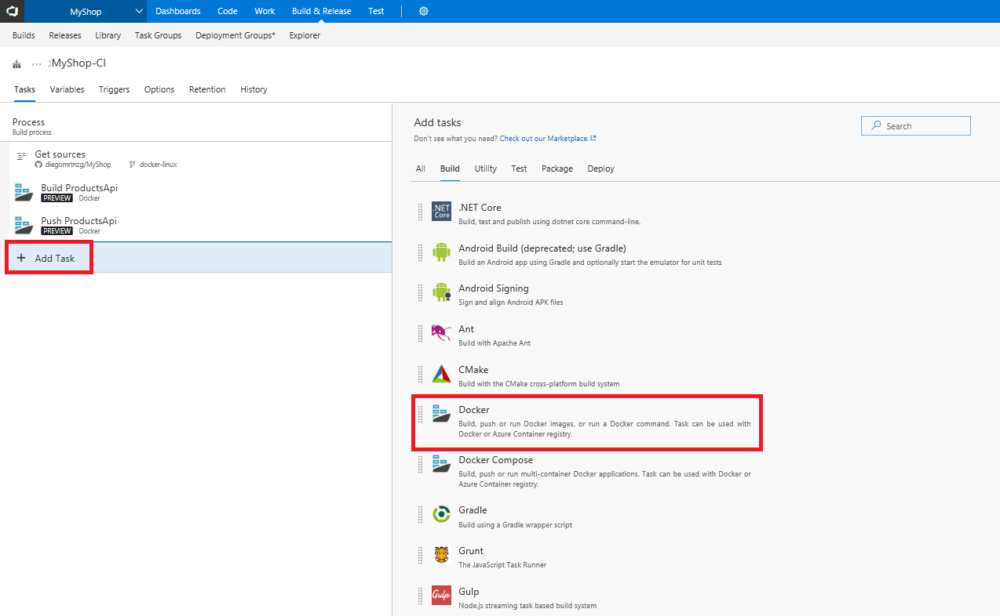

2. For each image, configure one step that uses the `docker build` command.

    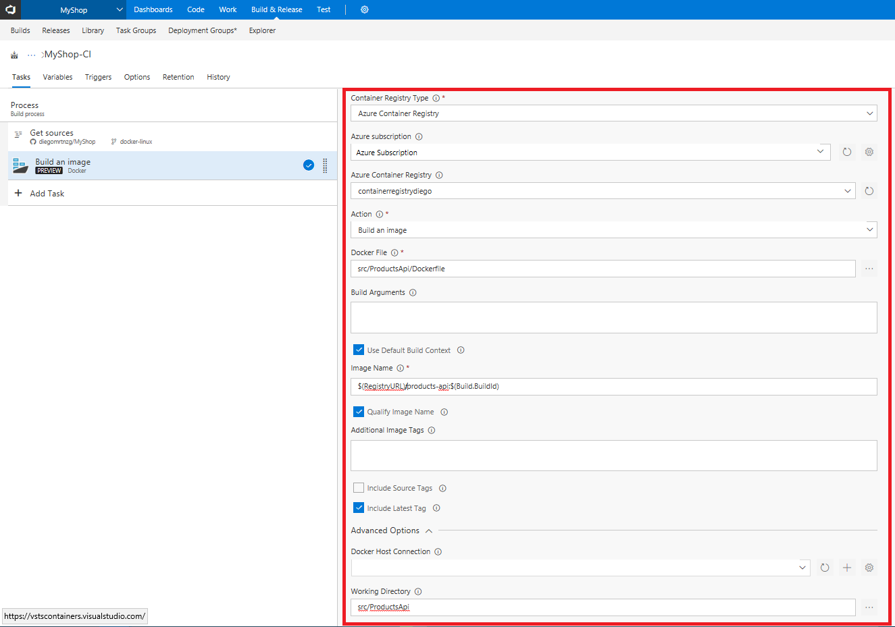

    For the build operation, select your Azure Container Registry, the **Build an image** action, and the Dockerfile that defines each image. Set the **Working Directory** as the Dockerfile root directory, define the **Image Name**, and select **Include Latest Tag**.
    
    The Image Name has to be in this format: ```$(RegistryURL)/[NAME]:$(Build.BuildId)```. Replace **[NAME]** with the image name:
    - ```proxy```
    - ```products-api```
    - ```ratings-api```
    - ```recommendations-api```
    - ```shopfront```

3. For each image, configure a second step that uses the `docker push` command.

    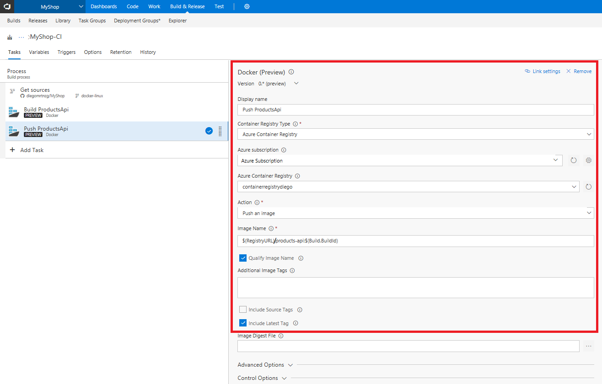

    For the push operation, select your Azure container registry, the **Push an image** action, enter the **Image Name** that is built in the previous step and select **Include Latest Tag**.

4. After you configure the build and push steps for each of the five images, add three more steps in the build workflow.

   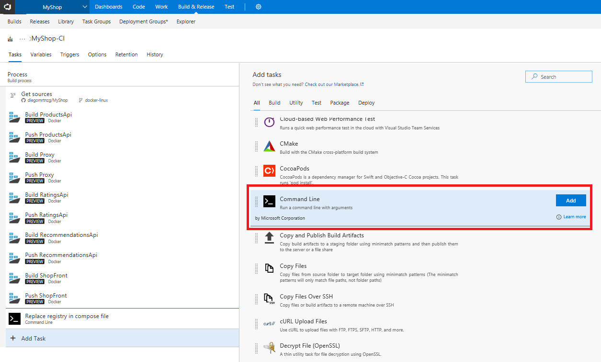

      1. A command-line task that uses a bash script to replace the *RegistryURL* occurrence in the docker-compose.yml file with the RegistryURL variable. 
    
          ```-c "sed -i 's/RegistryUrl/$(RegistryURL)/g' src/docker-compose-v3.yml"```

          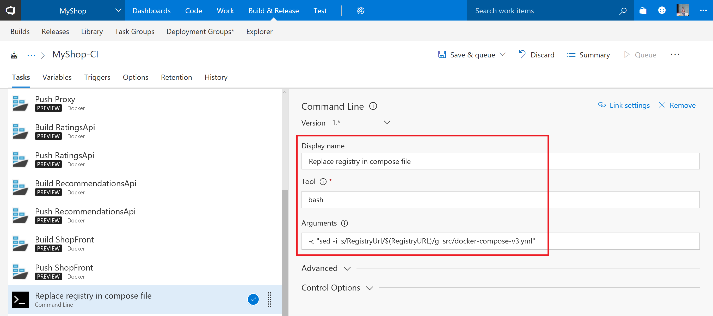

      2. A command-line task that uses a bash script to replace the *AgentURL* occurrence in the docker-compose.yml file with the AgentURL variable.
  
          ```-c "sed -i 's/AgentUrl/$(AgentURL)/g' src/docker-compose-v3.yml"```

     3. A task that drops the updated Compose file as a build artifact so it can be used in the release. See the following screen for details.

         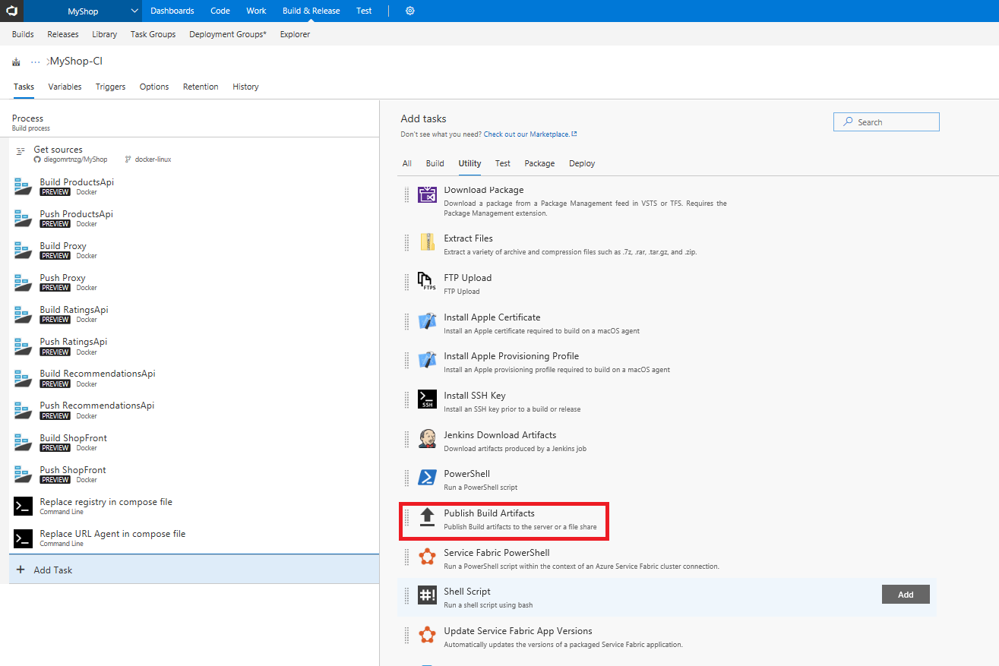 

         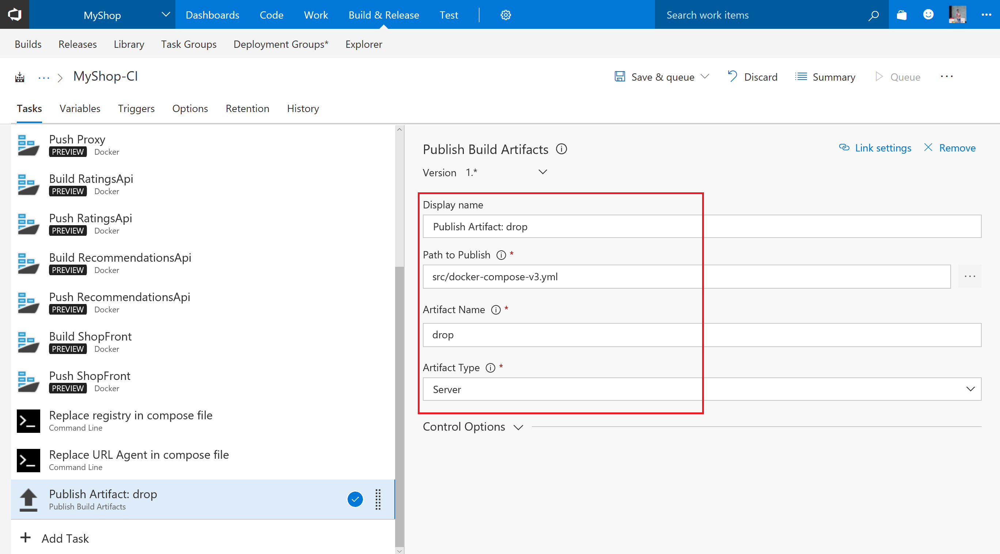 

5. Click **Save & queue** to test your build definition.

   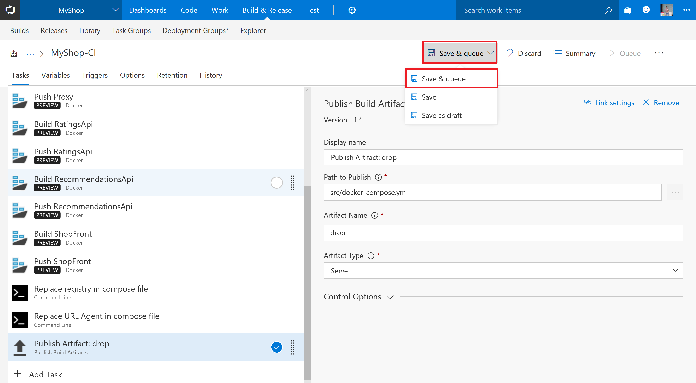 

   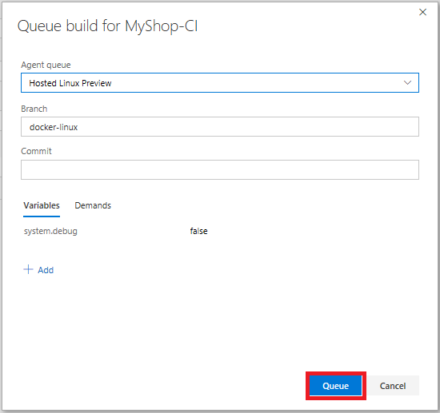 

6. If the **Build** is correct, you have to see this screen:

  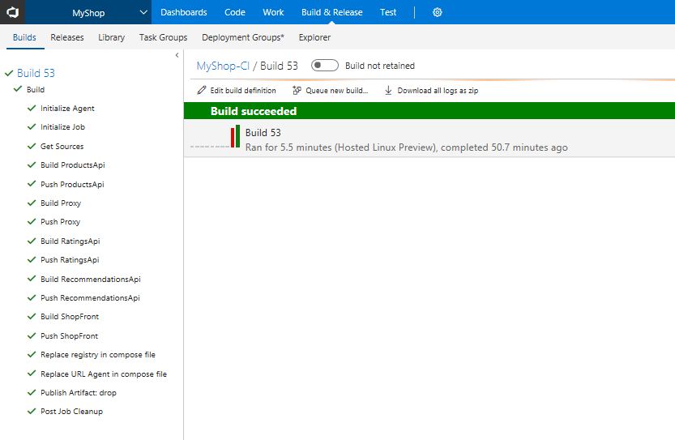 

## Step 3: Create the release definition

Visual Studio Team Services allows you to [manage releases across environments](https://www.visualstudio.com/team-services/release-management/). You can enable continuous deployment to make sure that your application is deployed on your different environments (such as dev, test, pre-production, and production) in a smooth way. You can create an environment that represents your Azure Container Service Docker Swarm Mode cluster.

 

### Initial release setup

1. To create a release definition, click **Releases** > **+ Release**

2. To configure the artifact source, Click **Artifacts** > **Link an artifact source**. Here, link this new release definition to the build that you defined in the previous step. After that, the docker-compose.yml file is available in the release process.

    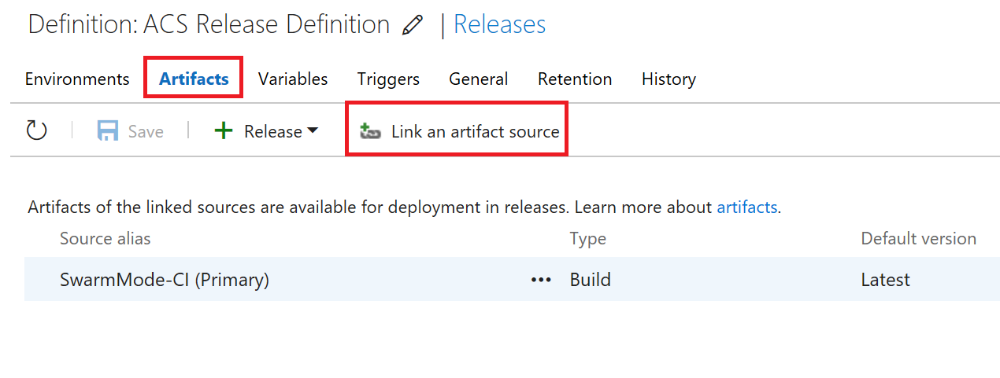 

3. To configure the release trigger, click **Triggers** and select **Continuous Deployment**. Set the trigger on the same artifact source. This setting ensures that a new release starts when the build completes successfully.

    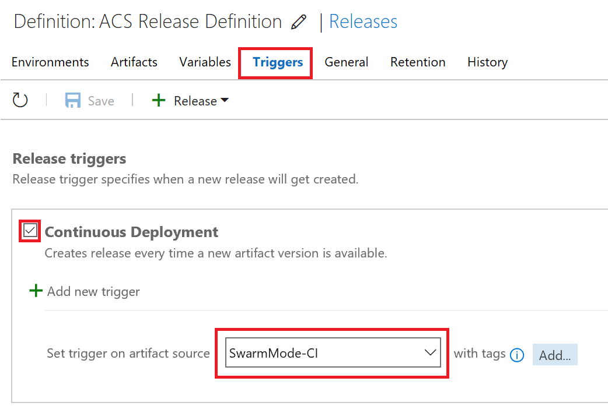 

4. To configure the release variables, click **Variables** and select **+Variable** to create three new variables with the info of the registry: **docker.username**, **docker.password**, and **docker.registry**. Paste the values of your Registry and Cluster Agents DNS.

    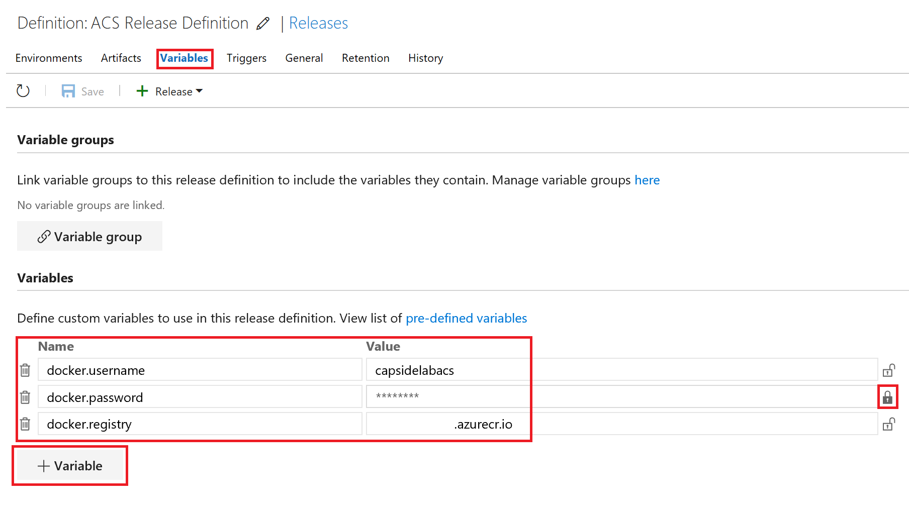

    >[!IMPORTANT]
    > As shown on the previous screen, click the **Lock** checkbox in docker.password. This setting is important to restrict the password.
    >

### Define the release workflow

The release workflow is composed of two tasks that you add.

1. Configure a task to securely copy the compose file to a *deploy* folder on the Docker Swarm master node, using the SSH connection you configured previously. See the following screen for details.
    
    Source folder: ```$(System.DefaultWorkingDirectory)/MyShop-CI/drop```

    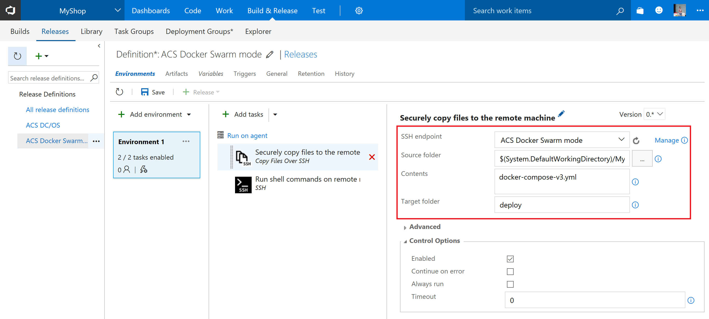

2. Configure a second task to execute a bash command to run `docker` and `docker stack deploy` commands on the master node. See the following screen for details.

    ```docker login -u $(docker.username) -p $(docker.password) $(docker.registry) && export DOCKER_HOST=:2375 && cd deploy && docker stack deploy --compose-file docker-compose-v3.yml myshop --with-registry-auth```

    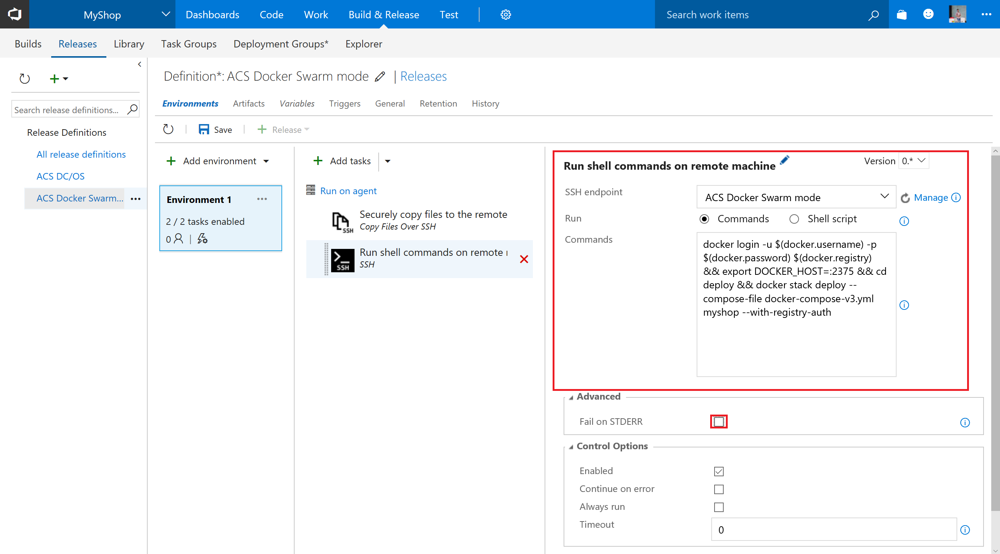

    The command executed on the master uses the Docker CLI and the Docker-Compose CLI to do the following tasks:

    - Log in to the Azure container registry (it uses three build variables that are defined in the **Variables** tab)
    - Define the **DOCKER_HOST** variable to work with the Swarm endpoint (:2375)
    - Navigate to the *deploy* folder that was created by the preceding secure copy task and that contains the docker-compose.yml file 
    - Execute `docker stack deploy` commands that pull the new images and create the containers.

    >[!IMPORTANT]
    > As shown on the previous screen, leave the **Fail on STDERR** checkbox unchecked. This setting allows us to complete the release process due to `docker-compose` prints several diagnostic messages, such as containers are stopping or being deleted, on the standard error output. If you check the checkbox, Visual Studio Team Services reports that errors occurred during the release, even if all goes well.
    >
3. Save this new release definition.

## Step 4: Test the CI/CD pipeline

Now that you are done with the configuration, it's time to test this new CI/CD pipeline. The easiest way to test it is to update the source code and commit the changes into your GitHub repository. A few seconds after you push the code, you will see a new build running in Visual Studio Team Services. Once completed successfully, a new release is triggered and deployed the new version of the application on the Azure Container Service cluster.

## Next steps

* For more information about CI/CD with Visual Studio Team Services, see the [VSTS Build overview](https://www.visualstudio.com/docs/build/overview).
* For more information about ACS Engine, see the [ACS Engine GitHub repo](https://github.com/Azure/acs-engine).
* For more information about Docker Swarm mode, see the [Docker Swarm mode overview](https://docs.docker.com/engine/swarm/).
