# Tutorial: Use Azure portal to create a Data Factory pipeline to copy data 
> [!div class="op_single_selector"]
> * [Overview and prerequisites](data-factory-copy-data-from-azure-blob-storage-to-sql-database.md)
> * [Copy Wizard](data-factory-copy-data-wizard-tutorial.md)
> * [Azure portal](data-factory-copy-activity-tutorial-using-azure-portal.md)
> * [Visual Studio](data-factory-copy-activity-tutorial-using-visual-studio.md)
> * [PowerShell](data-factory-copy-activity-tutorial-using-powershell.md)
> * [Azure Resource Manager template](data-factory-copy-activity-tutorial-using-azure-resource-manager-template.md)
> * [REST API](data-factory-copy-activity-tutorial-using-rest-api.md)
> * [.NET API](data-factory-copy-activity-tutorial-using-dotnet-api.md)
> 

> [!NOTE]
> This article applies to version 1 of Data Factory, which is generally available (GA). If you are using version 2 of the Data Factory service, which is in preview, see [copy activity tutorial in version 2 documentation](../quickstart-create-data-factory-dot-net.md). 

In this article, you learn how to use [Azure portal](https://portal.azure.com) to create a data factory with a pipeline that copies data from an Azure blob storage to an Azure SQL database. If you are new to Azure Data Factory, read through the [Introduction to Azure Data Factory](data-factory-introduction.md) article before doing this tutorial.   

In this tutorial, you create a pipeline with one activity in it: Copy Activity. The copy activity copies data from a supported data store to a supported sink data store. For a list of data stores supported as sources and sinks, see [supported data stores](data-factory-data-movement-activities.md#supported-data-stores-and-formats). The activity is powered by a globally available service that can copy data between various data stores in a secure, reliable, and scalable way. For more information about the Copy Activity, see [Data Movement Activities](data-factory-data-movement-activities.md).

A pipeline can have more than one activity. And, you can chain two activities (run one activity after another) by setting the output dataset of one activity as the input dataset of the other activity. For more information, see [multiple activities in a pipeline](data-factory-scheduling-and-execution.md#multiple-activities-in-a-pipeline). 

> [!NOTE] 
> The data pipeline in this tutorial copies data from a source data store to a destination data store. For a tutorial on how to transform data using Azure Data Factory, see [Tutorial: Build a pipeline to transform data using Hadoop cluster](data-factory-build-your-first-pipeline.md).

## Prerequisites
Complete prerequisites listed in the [tutorial prerequisites](data-factory-copy-data-from-azure-blob-storage-to-sql-database.md) article before performing this tutorial.

## Steps
Here are the steps you perform as part of this tutorial:

1. Create an Azure **data factory**. In this step, you create a data factory named ADFTutorialDataFactory. 
2. Create **linked services** in the data factory. In this step, you create two linked services of types: Azure Storage and Azure SQL Database. 
	
	The AzureStorageLinkedService links your Azure storage account to the data factory. You created a container and uploaded data to this storage account as part of [prerequisites](data-factory-copy-data-from-azure-blob-storage-to-sql-database.md).   

	AzureSqlLinkedService links your Azure SQL database to the data factory. The data that is copied from the blob storage is stored in this database. You created a SQL table in this database as part of [prerequisites](data-factory-copy-data-from-azure-blob-storage-to-sql-database.md).   
3. Create input and output **datasets** in the data factory.  
	
	The Azure storage linked service specifies the connection string that Data Factory service uses at run time to connect to your Azure storage account. And, the input blob dataset specifies the container and the folder that contains the input data.  

	Similarly, the Azure SQL Database linked service specifies the connection string that Data Factory service uses at run time to connect to your Azure SQL database. And, the output SQL table dataset specifies the table in the database to which the data from the blob storage is copied.
4. Create a **pipeline** in the data factory. In this step, you create a pipeline with a copy activity.   
	
	The copy activity copies data from a blob in the Azure blob storage to a table in the Azure SQL database. You can use a copy activity in a pipeline to copy data from any supported source to any supported destination. For a list of supported data stores, see [data movement activities](data-factory-data-movement-activities.md#supported-data-stores-and-formats) article. 
5. Monitor the pipeline. In this step, you **monitor** the slices of input and output datasets by using Azure portal. 

## Create data factory
> [!IMPORTANT]
> Complete [prerequisites for the tutorial](data-factory-copy-data-from-azure-blob-storage-to-sql-database.md) if you haven't already done so.   

A data factory can have one or more pipelines. A pipeline can have one or more activities in it. For example, a Copy Activity to copy data from a source to a destination data store and a HDInsight Hive activity to run a Hive script to transform input data to product output data. Let's start with creating the data factory in this step.

1. After logging in to the [Azure portal](https://portal.azure.com/), click **New** on the left menu, click **Data + Analytics**, and click **Data Factory**. 
   
   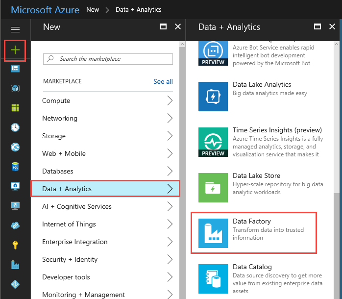    
2. In the **New data factory** blade:
   
   1. Enter **ADFTutorialDataFactory** for the **name**. 
      
         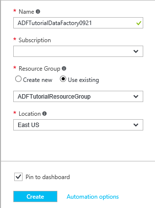
      
       The name of the Azure data factory must be **globally unique**. If you receive the following error, change the name of the data factory (for example, yournameADFTutorialDataFactory) and try creating again. See [Data Factory - Naming Rules](data-factory-naming-rules.md) topic for naming rules for Data Factory artifacts.
      
           Data factory name “ADFTutorialDataFactory” is not available  
      
       
   2. Select your Azure **subscription** in which you want to create the data factory. 
   3. For the **Resource Group**, do one of the following steps:
      
      - Select **Use existing**, and select an existing resource group from the drop-down list. 
      - Select **Create new**, and enter the name of a resource group.   
         
          Some of the steps in this tutorial assume that you use the name: **ADFTutorialResourceGroup** for the resource group. To learn about resource groups, see [Using resource groups to manage your Azure resources](../../azure-resource-manager/resource-group-overview.md).  
   4. Select the **location** for the data factory. Only regions supported by the Data Factory service are shown in the drop-down list.
   5. Select **Pin to dashboard**.     
   6. Click **Create**.
      
      > [!IMPORTANT]
      > To create Data Factory instances, you must be a member of the [Data Factory Contributor](../../active-directory/role-based-access-built-in-roles.md#data-factory-contributor) role at the subscription/resource group level.
      > 
      > The name of the data factory may be registered as a DNS name in the future and hence become publically visible.                
      > 
      > 
3. On the dashboard, you see the following tile with status: **Deploying data factory**. 

	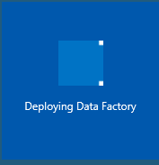
4. After the creation is complete, you see the **Data Factory** blade as shown in the image.
   
   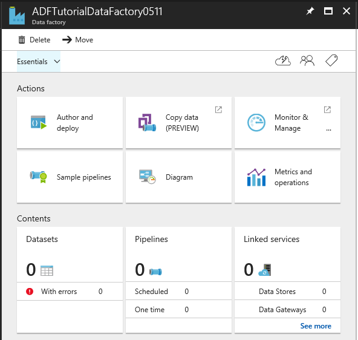

## Create linked services
You create linked services in a data factory to link your data stores and compute services to the data factory. In this tutorial, you don't use any compute service such as Azure HDInsight or Azure Data Lake Analytics. You use two data stores of type Azure Storage (source) and Azure SQL Database (destination). 

Therefore, you create two linked services named AzureStorageLinkedService and AzureSqlLinkedService of types: AzureStorage and AzureSqlDatabase.  

The AzureStorageLinkedService links your Azure storage account to the data factory. This storage account is the one in which you created a container and uploaded the data as part of [prerequisites](data-factory-copy-data-from-azure-blob-storage-to-sql-database.md).   

AzureSqlLinkedService links your Azure SQL database to the data factory. The data that is copied from the blob storage is stored in this database. You created the emp table in this database as part of [prerequisites](data-factory-copy-data-from-azure-blob-storage-to-sql-database.md).  

### Create Azure Storage linked service
In this step, you link your Azure storage account to your data factory. You specify the name and key of your Azure storage account in this section.  

1. In the **Data Factory** blade, click **Author and deploy** tile.
   
   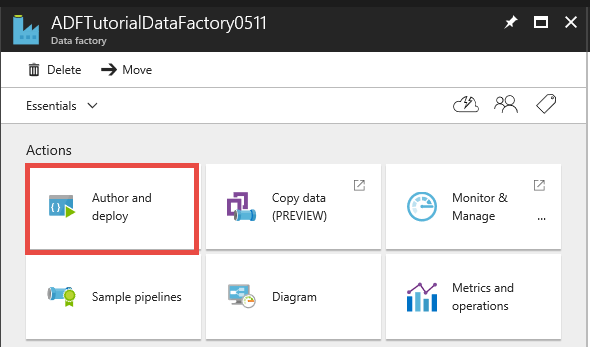 
2. You see the **Data Factory Editor** as shown in the following image: 

	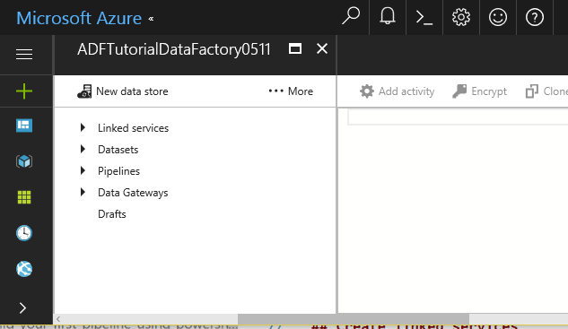
3. In the editor, click **New data store** button on the toolbar and select **Azure storage** from the drop-down menu. You should see the JSON template for creating an Azure storage linked service in the right pane. 
   
    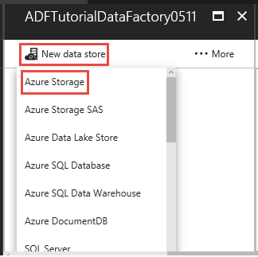    
3. Replace `<accountname>` and `<accountkey>` with the account name and account key values for your Azure storage account. 
   
        
4. Click **Deploy** on the toolbar. You should see the deployed **AzureStorageLinkedService** in the tree view now. 
   
    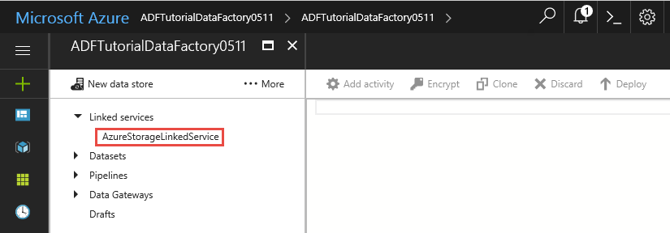

	For more information about JSON properties in the linked service definition, see [Azure Blob Storage connector](data-factory-azure-blob-connector.md#linked-service-properties) article.

### Create a linked service for the Azure SQL Database
In this step, you link your Azure SQL database to your data factory. You specify the Azure SQL server name, database name, user name, and user password in this section. 

1. In the **Data Factory Editor**, click **New data store** button on the toolbar and select **Azure SQL Database** from the drop-down menu. You should see the JSON template for creating the Azure SQL linked service in the right pane.
2. Replace `<servername>`, `<databasename>`, `<username>@<servername>`, and `<password>` with names of your Azure SQL server, database, user account, and password. 
3. Click **Deploy** on the toolbar to create and deploy the **AzureSqlLinkedService**.
4. Confirm that you see **AzureSqlLinkedService** in the tree view under **Linked services**.  

	For more information about these JSON properties, see [Azure SQL Database connector](data-factory-azure-sql-connector.md#linked-service-properties).

## Create datasets
In the previous step, you created linked services to link your Azure Storage account and Azure SQL database to your data factory. In this step, you define two datasets named InputDataset and OutputDataset that represent input and output data that is stored in the data stores referred by AzureStorageLinkedService and AzureSqlLinkedService respectively.

The Azure storage linked service specifies the connection string that Data Factory service uses at run time to connect to your Azure storage account. And, the input blob dataset (InputDataset) specifies the container and the folder that contains the input data.  

Similarly, the Azure SQL Database linked service specifies the connection string that Data Factory service uses at run time to connect to your Azure SQL database. And, the output SQL table dataset (OututDataset) specifies the table in the database to which the data from the blob storage is copied. 

### Create input dataset
In this step, you create a dataset named InputDataset that points to a blob file (emp.txt) in the root folder of a blob container (adftutorial) in the Azure Storage represented by the AzureStorageLinkedService linked service. If you don't specify a value for the fileName (or skip it), data from all blobs in the input folder are copied to the destination. In this tutorial, you specify a value for the fileName. 

1. In the **Editor** for the Data Factory, click **... More**, click **New dataset**, and click **Azure Blob storage** from the drop-down menu. 
   
    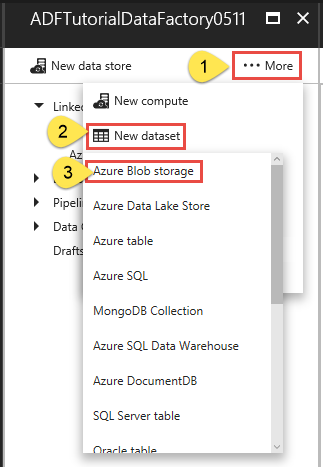
2. Replace JSON in the right pane with the following JSON snippet: 
   
	```json
    {
      "name": "InputDataset",
      "properties": {
        "structure": [
          {
            "name": "FirstName",
            "type": "String"
          },
          {
            "name": "LastName",
            "type": "String"
          }
        ],
        "type": "AzureBlob",
        "linkedServiceName": "AzureStorageLinkedService",
        "typeProperties": {
          "folderPath": "adftutorial/",
          "fileName": "emp.txt",
          "format": {
            "type": "TextFormat",
            "columnDelimiter": ","
          }
        },
        "external": true,
        "availability": {
          "frequency": "Hour",
          "interval": 1
        }
      }
    }
	```   

    The following table provides descriptions for the JSON properties used in the snippet:

	| Property | Description |
	|:--- |:--- |
	| type | The type property is set to **AzureBlob** because data resides in an Azure blob storage. |
	| linkedServiceName | Refers to the **AzureStorageLinkedService** that you created earlier. |
	| folderPath | Specifies the blob **container** and the **folder** that contains input blobs. In this tutorial, adftutorial is the blob container and folder is the root folder. | 
	| fileName | This property is optional. If you omit this property, all files from the folderPath are picked. In this tutorial, **emp.txt** is specified for the fileName, so only that file is picked up for processing. |
	| format -> type |The input file is in the text format, so we use **TextFormat**. |
	| columnDelimiter | The columns in the input file are delimited by **comma character (`,`)**. |
	| frequency/interval | The frequency is set to **Hour** and interval is  set to **1**, which means that the input slices are available **hourly**. In other words, the Data Factory service looks for input data every hour in the root folder of blob container (**adftutorial**) you specified. It looks for the data within the pipeline start and end times, not before or after these times.  |
	| external | This property is set to **true** if the data is not generated by this pipeline. The input data in this tutorial is in the emp.txt file, which is not generated by this pipeline, so we set this property to true. |

    For more information about these JSON properties, see [Azure Blob connector article](data-factory-azure-blob-connector.md#dataset-properties).		
3. Click **Deploy** on the toolbar to create and deploy the **InputDataset** dataset. Confirm that you see the **InputDataset** in the tree view.

### Create output dataset
The Azure SQL Database linked service specifies the connection string that Data Factory service uses at run time to connect to your Azure SQL database. The output SQL table dataset (OututDataset) you create in this step specifies the table in the database to which the data from the blob storage is copied.

1. In the **Editor** for the Data Factory, click **... More**, click **New dataset**, and click **Azure SQL** from the drop-down menu. 
2. Replace JSON in the right pane with the following JSON snippet:

	```json   
    {
      "name": "OutputDataset",
      "properties": {
        "structure": [
          {
            "name": "FirstName",
            "type": "String"
          },
          {
            "name": "LastName",
            "type": "String"
          }
        ],
        "type": "AzureSqlTable",
        "linkedServiceName": "AzureSqlLinkedService",
        "typeProperties": {
          "tableName": "emp"
        },
        "availability": {
          "frequency": "Hour",
          "interval": 1
        }
      }
    }
	```   	

    The following table provides descriptions for the JSON properties used in the snippet:

	| Property | Description |
	|:--- |:--- |
	| type | The type property is set to **AzureSqlTable** because data is copied to a table in an Azure SQL database. |
	| linkedServiceName | Refers to the **AzureSqlLinkedService** that you created earlier. |
	| tableName | Specified the **table** to which the data is copied. | 
	| frequency/interval | The frequency is set to **Hour** and interval is **1**, which means that the output slices are produced **hourly** between the pipeline start and end times, not before or after these times.  |

	There are three columns – **ID**, **FirstName**, and **LastName** – in the emp table in the database. ID is an identity column, so you need to specify only **FirstName** and **LastName** here.

	For more information about these JSON properties, see [Azure SQL connector article](data-factory-azure-sql-connector.md#dataset-properties).
3. Click **Deploy** on the toolbar to create and deploy the **OutputDataset** dataset. Confirm that you see the **OutputDataset** in the tree view under **Datasets**. 

## Create pipeline
In this step, you create a pipeline with a **copy activity** that uses **InputDataset** as an input and **OutputDataset** as an output.

Currently, output dataset is what drives the schedule. In this tutorial, output dataset is configured to produce a slice once an hour. The pipeline has a start time and end time that are one day apart, which is 24 hours. Therefore, 24 slices of output dataset are produced by the pipeline. 

1. In the **Editor** for the Data Factory, click **... More**, and click **New pipeline**. Alternatively, you can right-click **Pipelines** in the tree view and click **New pipeline**.
2. Replace JSON in the right pane with the following JSON snippet: 

	```json   
	{
	  "name": "ADFTutorialPipeline",
	  "properties": {
	    "description": "Copy data from a blob to Azure SQL table",
	    "activities": [
	      {
	        "name": "CopyFromBlobToSQL",
	        "type": "Copy",
	        "inputs": [
	          {
	            "name": "InputDataset"
	          }
	        ],
	        "outputs": [
	          {
	            "name": "OutputDataset"
	          }
	        ],
	        "typeProperties": {
	          "source": {
	            "type": "BlobSource"
	          },
	          "sink": {
	            "type": "SqlSink",
	            "writeBatchSize": 10000,
	            "writeBatchTimeout": "60:00:00"
	          }
	        },
	        "Policy": {
	          "concurrency": 1,
	          "executionPriorityOrder": "NewestFirst",
	          "retry": 0,
	          "timeout": "01:00:00"
	        }
	      }
	    ],
	    "start": "2017-05-11T00:00:00Z",
	    "end": "2017-05-12T00:00:00Z"
	  }
	} 
	```   
    
	Note the following points:
   
	- In the activities section, there is only one activity whose **type** is set to **Copy**. For more information about the copy activity, see [data movement activities](data-factory-data-movement-activities.md). In Data Factory solutions, you can also use [data transformation activities](data-factory-data-transformation-activities.md).
	- Input for the activity is set to **InputDataset** and output for the activity is set to **OutputDataset**. 
	- In the **typeProperties** section, **BlobSource** is specified as the source type and **SqlSink** is specified as the sink type. For a complete list of data stores supported by the copy activity as sources and sinks, see [supported data stores](data-factory-data-movement-activities.md#supported-data-stores-and-formats). To learn how to use a specific supported data store as a source/sink, click the link in the table.
	- Both start and end datetimes must be in [ISO format](http://en.wikipedia.org/wiki/ISO_8601). For example: 2016-10-14T16:32:41Z. The **end** time is optional, but we use it in this tutorial. If you do not specify value for the **end** property, it is calculated as "**start + 48 hours**". To run the pipeline indefinitely, specify **9999-09-09** as the value for the **end** property.
     
	In the preceding example, there are 24 data slices as each data slice is produced hourly.

	For descriptions of JSON properties in a pipeline definition, see [create pipelines](data-factory-create-pipelines.md) article. For descriptions of JSON properties in a copy activity definition, see [data movement activities](data-factory-data-movement-activities.md). For descriptions of JSON properties supported by BlobSource, see [Azure Blob connector article](data-factory-azure-blob-connector.md). For descriptions of JSON properties supported by SqlSink, see [Azure SQL Database connector article](data-factory-azure-sql-connector.md).
3. Click **Deploy** on the toolbar to create and deploy the **ADFTutorialPipeline**. Confirm that you see the pipeline in the tree view. 
4. Now, close the **Editor** blade by clicking **X**. Click **X** again to see the **Data Factory** home page for the **ADFTutorialDataFactory**.

**Congratulations!** You have successfully created an Azure data factory with a pipeline to copy data from an Azure blob storage to an Azure SQL database. 


## Monitor pipeline
In this step, you use the Azure portal to monitor what’s going on in an Azure data factory.    

### Monitor pipeline using Monitor & Manage App
The following steps show you how to monitor pipelines in your data factory by using the Monitor & Manage application: 

1. Click **Monitor & Manage** tile on the home page for your data factory.
   
     
2. You should see **Monitor & Manage application** in a separate tab. 

	> [!NOTE]
	> If you see that the web browser is stuck at "Authorizing...", do one of the following: clear the **Block third-party cookies and site data** check box (or) create an exception for **login.microsoftonline.com**, and then try to open the app again.

    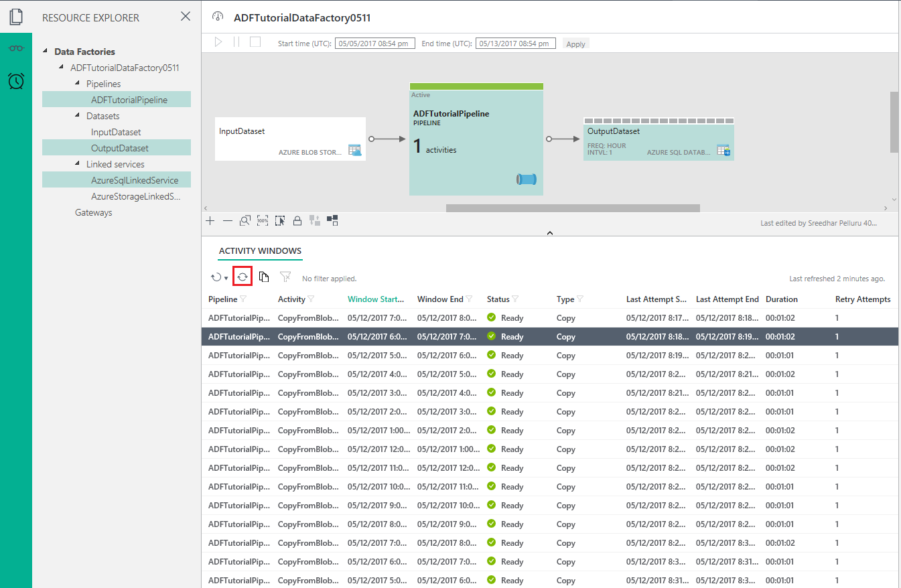
3. Change the **Start time** and **End time** to include start (2017-05-11) and end times (2017-05-12) of your pipeline, and click **Apply**.   	
3. You see the **activity windows** associated with each hour between pipeline start and end times in the list in the middle pane. 
4. To see details about an activity window, select the activity window in the **Activity Windows** list. 
    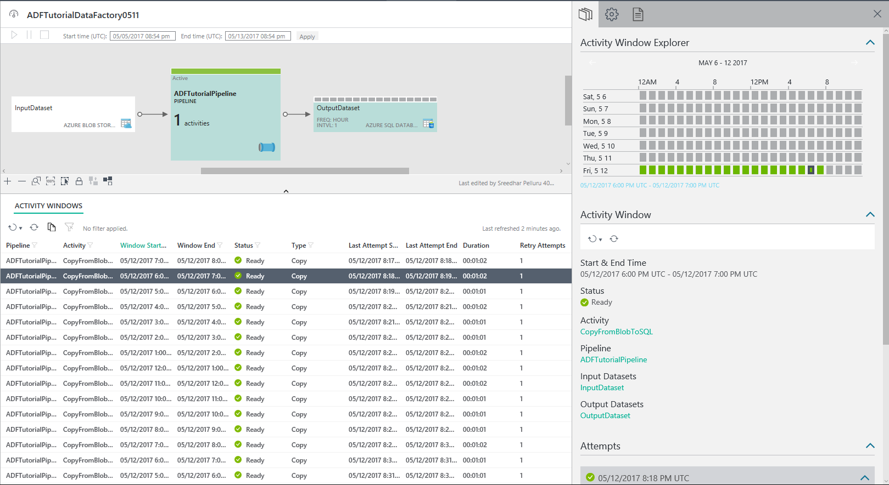

	In Activity Window Explorer on the right, you see that the slices up to the current UTC time (8:12 PM) are all processed (in green color). The 8-9 PM, 9 - 10 PM, 10 - 11 PM, 11 PM - 12 AM slices are not processed yet.

	The **Attempts** section in the right pane provides information about the activity run for the data slice. If there was an error, it provides details about the error. For example, if the input folder or container does not exist and the slice processing fails, you see an error message stating that the container or folder does not exist.

	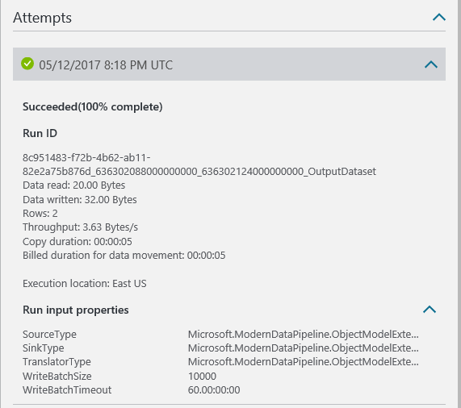 
4. Launch **SQL Server Management Studio**, connect to the Azure SQL Database, and verify that the rows are inserted in to the **emp** table in the database.
    
    

For detailed information about using this application, see [Monitor and manage Azure Data Factory pipelines using Monitoring and Management App](data-factory-monitor-manage-app.md).

### Monitor pipeline using Diagram View
You can also monitor data pipelines by using the diagram view.  

1. In the **Data Factory** blade, click **Diagram**.
   
    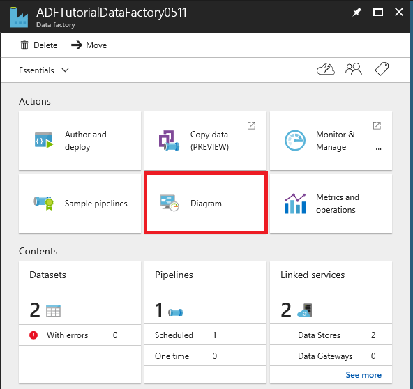
2. You should see the diagram similar to the following image: 
   
      
5. In the diagram view, double-click **InputDataset** to see slices for the dataset.  
   
    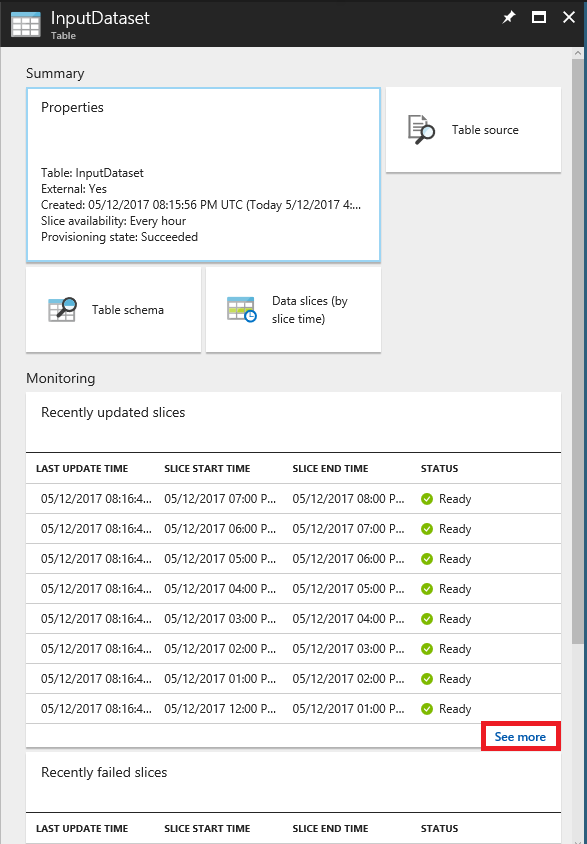   
5. Click **See more** link to see all the data slices. You see 24 hourly slices between pipeline start and end times. 
   
    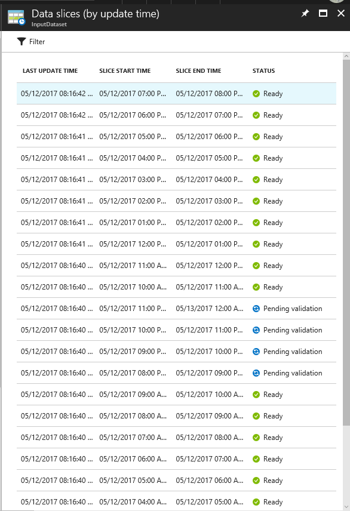  
   
    Notice that all the data slices up to the current UTC time are **Ready** because the **emp.txt** file exists all the time in the blob container: **adftutorial\input**. The slices for the future times are not in ready state yet. Confirm that no slices show up in the **Recently failed slices** section at the bottom.
6. Close the blades until you see the diagram view (or) scroll left to see the diagram view. Then, double-click **OutputDataset**. 
8. Click **See more** link on the **Table** blade for **OutputDataset** to see all the slices.

    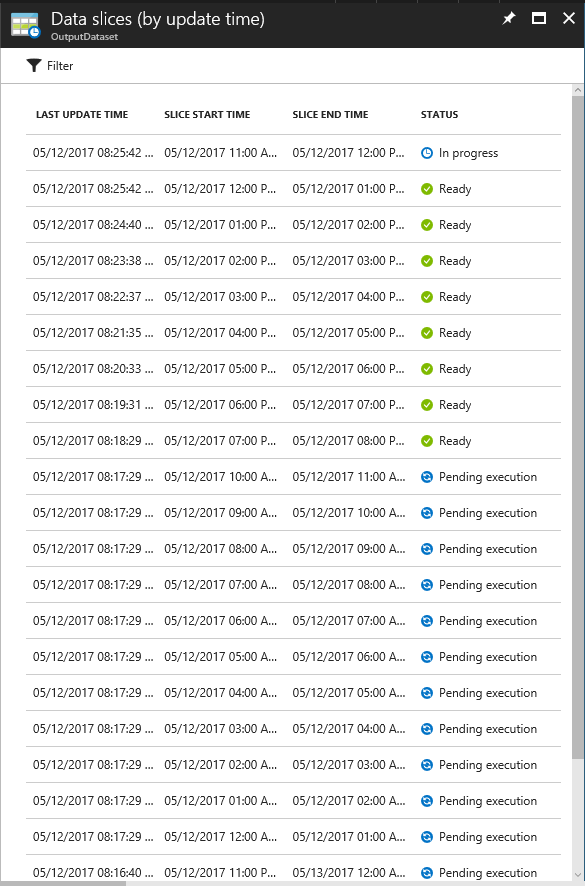 
9. Notice that all the slices up to the current UTC time move from **pending execution** state => **In progress** ==> **Ready** state. The slices from the past (before current time) are processed from latest to oldest by default. For example, if the current time is 8:12 PM UTC, the slice for 7 PM - 8 PM is processed ahead of the 6 PM - 7 PM slice. The 8 PM - 9 PM slice is processed at the end of the time interval by default, that is after 9 PM.  
10. Click any data slice from the list and you should see the **Data slice** blade. A piece of data associated with an activity window is called a slice. A slice can be one file or multiple files.  
    
     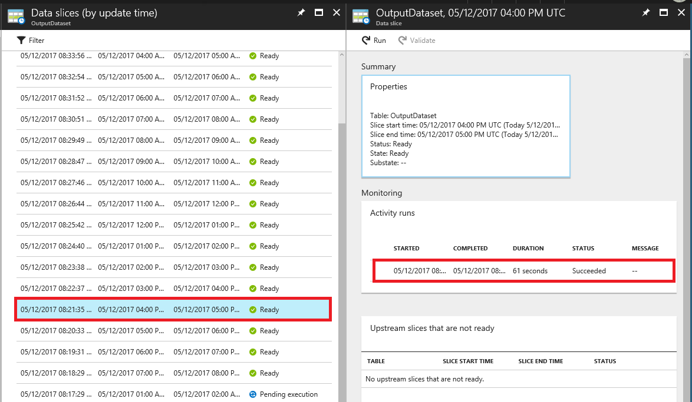
    
     If the slice is not in the **Ready** state, you can see the upstream slices that are not Ready and are blocking the current slice from executing in the **Upstream slices that are not ready** list.
11. In the **DATA SLICE** blade, you should see all activity runs in the list at the bottom. Click an **activity run** to see the **Activity run details** blade. 
    
    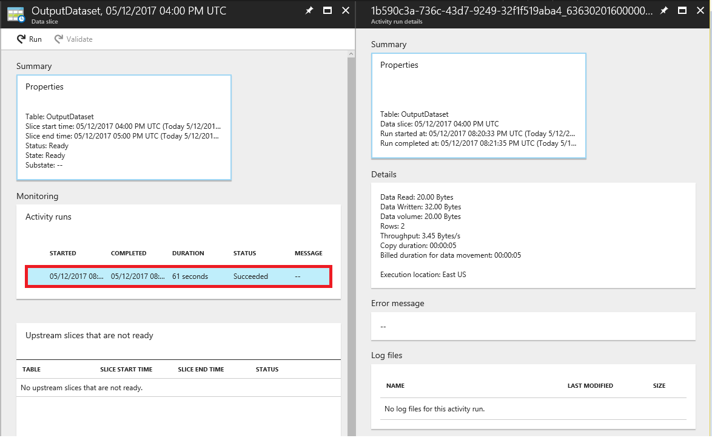

	In this blade, you see how long the copy operation took, what throughput is, how many bytes of data were read and written, run start time, run end time etc.  
12. Click **X** to close all the blades until you get back to the home blade for the **ADFTutorialDataFactory**.
13. (optional) click the **Datasets** tile or **Pipelines** tile to get the blades you have seen the preceding steps. 
14. Launch **SQL Server Management Studio**, connect to the Azure SQL Database, and verify that the rows are inserted in to the **emp** table in the database.
    
    


## Summary
In this tutorial, you created an Azure data factory to copy data from an Azure blob to an Azure SQL database. You used the Azure portal to create the data factory, linked services, datasets, and a pipeline. Here are the high-level steps you performed in this tutorial:  

1. Created an Azure **data factory**.
2. Created **linked services**:
   1. An **Azure Storage** linked service to link your Azure Storage account that holds input data.     
   2. An **Azure SQL** linked service to link your Azure SQL database that holds the output data. 
3. Created **datasets** that describe input data and output data for pipelines.
4. Created a **pipeline** with a **Copy Activity** with **BlobSource** as source and **SqlSink** as sink.  

## Next steps
In this tutorial, you used Azure blob storage as a source data store and an Azure SQL database as a destination data store in a copy operation. The following table provides a list of data stores supported as sources and destinations by the copy activity: 

[!INCLUDE [data-factory-supported-data-stores](../../../includes/data-factory-supported-data-stores.md)]

To learn about how to copy data to/from a data store, click the link for the data store in the table.