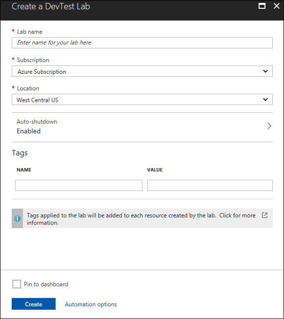

# Create a lab in Azure DevTest Labs
A lab in Azure DevTest Labs is the infrastructure that encompasses a group of resources, such as Virtual Machines (VMs), that lets you better manage those resources by specifying limits and quotas. This article walks you through the process of creating a lab using the Azure portal.

## Prerequisites
To create a lab, you need:

* An Azure subscription. To learn about Azure purchase options, see [How to buy Azure](https://azure.microsoft.com/pricing/purchase-options/) or [Free one-month trial](https://azure.microsoft.com/pricing/free-trial/). You must be the owner of the subscription to create the lab.

## Steps to create a lab in Azure DevTest Labs
The following steps illustrate how to use the Azure portal to create a lab in Azure DevTest Labs. 

1. Sign in to the [Azure portal](http://go.microsoft.com/fwlink/p/?LinkID=525040).
1. From the main menu on the left side, select **More Services** (at the bottom of the list).

	

1. From the list of available services, **DevTest Labs**.
1. In the **DevTest Labs** area, select **Add**.
   
    

1. Under **Create a DevTest Lab**:
   
	1. Enter a **Lab Name** for the new lab.
	2. Select the **Subscription** to associate with the lab.
	3. Select a **Location** in which to store the lab.
	4. Select **Auto-shutdown** to specify if you want to enable - and define the parameters for - the automatic shutting down of all the lab's VMs. The auto-shutdown feature is mainly a cost-saving feature whereby you can specify when you want the VM to automatically be shut down. You can change auto-shutdown settings after creating the lab by following the steps outlined in the article [Manage all policies for a lab in Azure DevTest Labs](./devtest-lab-set-lab-policy.md#set-auto-shutdown).
	1. Enter **NAME** and **VALUE** information for **Tags** if you want to create custom tagging that is added to every resource you will create in the lab. Tags are useful to help you manage and organize lab resources by category. For more information about tags, including how to add tags after creating the lab, see [Add tags to a lab](devtest-lab-add-tag.md).
	5. Select **Pin to Dashboard** if you want a shortcut of the lab to appear on the portal dashboard.
	6. Select **Automation options** to get Azure Resource Manager templates for configuration automation. 
	7. Select **Create**. You can monitor the status of the lab creation process by watching the **Notifications** area. Once completed, refresh the page to see the newly created lab in the list of labs.  
    
    

[!INCLUDE [devtest-lab-try-it-out](../../includes/devtest-lab-try-it-out.md)]

## Next steps
Once you've created your lab, here are some next steps to consider:

* [Secure access to a lab](devtest-lab-add-devtest-user.md).
* [Set lab policies](devtest-lab-set-lab-policy.md).
* [Create a lab template](devtest-lab-create-template.md).
* [Create custom artifacts for your VMs](devtest-lab-artifact-author.md).
* [Add a VM with artifacts to a lab](https://azure.microsoft.com/resources/videos/how-to-create-vms-with-artifacts-in-a-devtest-lab/).

