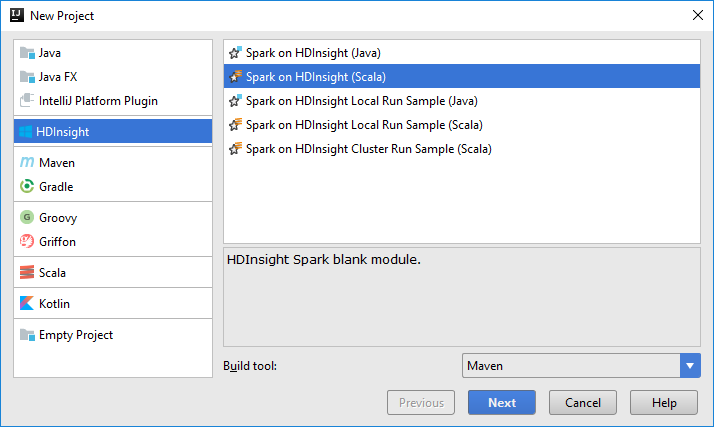
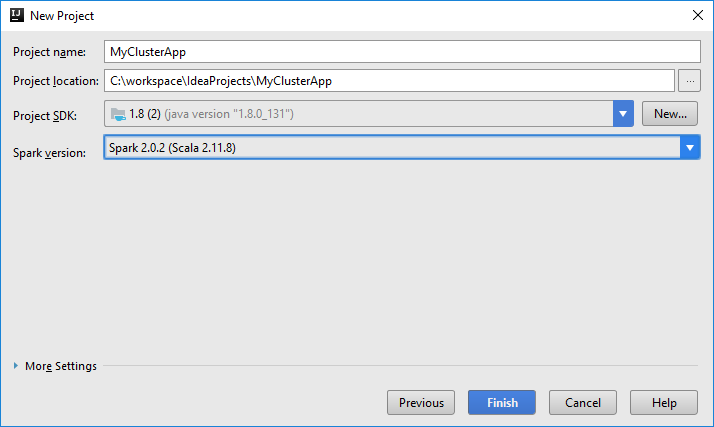
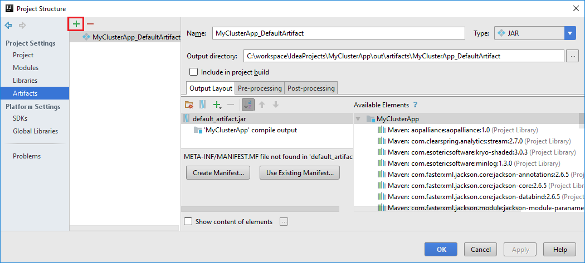
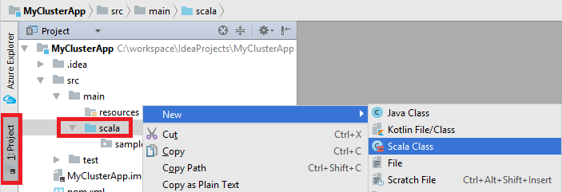
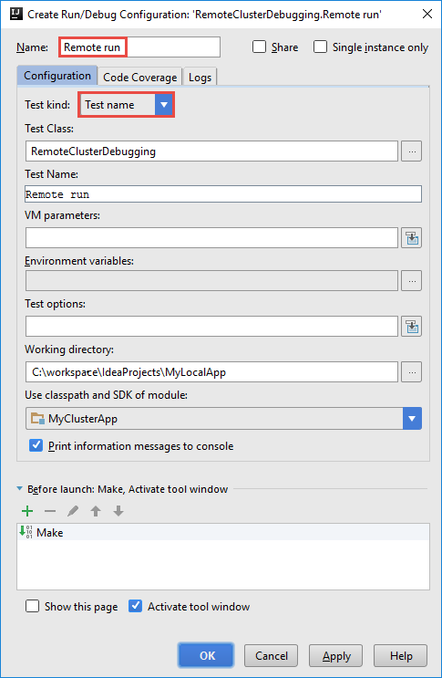

# Use Azure Toolkit for IntelliJ to debug Spark applications remotely in HDInsight through VPN

We recommend debugging spark applications remotely through SSH. For instructions, see [Remotely debug Spark applications on an HDInsight cluster with Azure Toolkit for IntelliJ through SSH](https://docs.microsoft.com/en-us/azure/hdinsight/hdinsight-apache-spark-intellij-tool-debug-remotely-through-ssh).

This article provides step-by-step guidance on how to use the HDInsight Tools in Azure Toolkit for IntelliJ to submit a Spark job on an HDInsight Spark cluster, and then debug it remotely from your desktop computer. To complete these tasks, you must perform the following high-level steps:

1. Create a site-to-site or point-to-site Azure virtual network. The steps in this document assume that you use a site-to-site network.
2. Create a Spark cluster in HDInsight that is part of the site-to-site virtual network.
3. Verify the connectivity between the cluster head node and your desktop.
4. Create a Scala application in IntelliJ IDEA, and then configure it for remote debugging.
5. Run and debug the application.

## Prerequisites
* **An Azure subscription**. For more information, see [Get a free trial of Azure](https://azure.microsoft.com/documentation/videos/get-azure-free-trial-for-testing-hadoop-in-hdinsight/).
* **An Apache Spark cluster in HDInsight**. For instructions, see [Create Apache Spark clusters in Azure HDInsight](hdinsight-apache-spark-jupyter-spark-sql.md).
* **Oracle Java development kit**. You can install it from the [Oracle website](http://www.oracle.com/technetwork/java/javase/downloads/jdk8-downloads-2133151.html).
* **IntelliJ IDEA**. This article uses version 2017.1. You can install it from the [JetBrains website](https://www.jetbrains.com/idea/download/).
* **HDInsight Tools in Azure Toolkit for IntelliJ**. HDInsight tools for IntelliJ are available as part of Azure Toolkit for IntelliJ. For instructions on how to install Azure Toolkit, see [Install Azure Toolkit for IntelliJ](../azure-toolkit-for-intellij-installation.md).
* **Sign in to your Azure Subscription from IntelliJ IDEA**. Follow the instructions in [Use Azure Toolkit for IntelliJ to create Spark applications for an HDInsight cluster](hdinsight-apache-spark-intellij-tool-plugin.md).
* **Exception workaround**. While running the Spark Scala application for remote debugging on a Windows computer, you might get an exception. This exception is explained in [SPARK-2356](https://issues.apache.org/jira/browse/SPARK-2356) and occurs due to a missing WinUtils.exe file in Windows. To work around this error, you must [download the executable file](http://public-repo-1.hortonworks.com/hdp-win-alpha/winutils.exe) to a location such as **C:\WinUtils\bin**. Add an **HADOOP_HOME** environment variable, and then set the value of the variable to **C\WinUtils**.

## Step 1: Create an Azure virtual network
Follow the instructions from the following links to create an Azure virtual network, and then verify the connectivity between your desktop computer and the virtual network:

* [Create a VNet with a site-to-site VPN connection using the Azure portal](../vpn-gateway/vpn-gateway-howto-site-to-site-resource-manager-portal.md)
* [Create a VNet with a site-to-site VPN connection using PowerShell](../vpn-gateway/vpn-gateway-create-site-to-site-rm-powershell.md)
* [Configure a point-to-site connection to a virtual network using PowerShell](../vpn-gateway/vpn-gateway-howto-point-to-site-rm-ps.md)

## Step 2: Create an HDInsight Spark cluster
We recommend that you also create an Apache Spark cluster in Azure HDInsight that is part of the Azure virtual network that you created. Use the information available in [Create Linux-based clusters in HDInsight](hdinsight-hadoop-provision-linux-clusters.md). As part of optional configuration, select the Azure virtual network that you created in the previous step.

## Step 3: Verify the connectivity between the cluster head node and your desktop
1. Get the IP address of the head node. Open Ambari UI for the cluster. From the cluster blade, select **Dashboard**.

    
2. From the Ambari UI, select **Hosts**.

    
3. You see a list of head nodes, worker nodes, and zookeeper nodes. The head nodes have an **hn*** prefix. Select the first head node.

    
4. From the **Summary** pane at the bottom of the page that opens, copy the **IP Address** of the head node and the **Hostname**.

    
5. Add the IP address and the hostname of the head node to the **hosts** file on the computer where you want to run and remotely debug the Spark job. This enables you to communicate with the head node by using the IP address, as well as the hostname.

   a. Open a Notepad file with elevated permissions. From the **File** menu, select **Open**, and then find the location of the hosts file. On a Windows computer, the location is **C:\Windows\System32\Drivers\etc\hosts**.

   b. Add the following information to the **hosts** file:

           # For headnode0
           192.xxx.xx.xx hn0-nitinp
           192.xxx.xx.xx hn0-nitinp.lhwwghjkpqejawpqbwcdyp3.gx.internal.cloudapp.net

           # For headnode1
           192.xxx.xx.xx hn1-nitinp
           192.xxx.xx.xx hn1-nitinp.lhwwghjkpqejawpqbwcdyp3.gx.internal.cloudapp.net
6. From the computer that you connected to the Azure virtual network that is used by the HDInsight cluster, verify that you can ping the head nodes by using the IP address, as well as the hostname.
7. Use SSH to connect to the cluster head node by following the instructions in [Connect to an HDInsight cluster using SSH](hdinsight-hadoop-linux-use-ssh-unix.md). From the cluster head node, ping the IP address of the desktop computer. Test the connectivity to both IP addresses assigned to the computer:

    - One for the network connection
    - One for the Azure virtual network

8. Repeat the steps for the other head node.

## Step 4: Create a Spark Scala application by using HDInsight Tools in Azure Toolkit for IntelliJ and configure it for remote debugging
1. Open IntelliJ IDEA and create a new project. In the **New Project** dialog box, do the following:

    

    a. Select **HDInsight** > **Spark on HDInsight (Scala)**.

    b. Select **Next**.
2. In the next **New Project** dialog box, do the following, and then select **Finish**:

    - Enter a project name and location.

    - In the **Project SDK** drop-down list, select **Java 1.8** for the Spark 2.x cluster, or select **Java 1.7** for the Spark 1.x cluster.

    - In the **Spark version** drop-down list, the Scala project creation wizard integrates the proper version for the Spark SDK and the Scala SDK. If the Spark cluster version is earlier than 2.0, select **Spark 1.x**. Otherwise, select **Spark2.x**. This example uses **Spark 2.0.2 (Scala 2.11.8)**.
  
   
  
3. The Spark project automatically creates an artifact for you. To view the artifact, do the following:

    a. From the **File** menu, select **Project Structure**.

    b. In the **Project Structure** dialog box, select **Artifacts** to view the default artifact that is created. You can also create your own artifact by selecting the plus sign (**+**).

   

4. Add libraries to your project. To add a library, do the following:

    a. Right-click the project name in the project tree, and then select **Open Module Settings**. 

    b. In the **Project Structure** dialog box, select **Libraries**, select the (**+**) symbol, and then select **From Maven**.

    

    c. In the **Download Library from Maven Repository** dialog box, search for and add the following libraries:

   * `org.scalatest:scalatest_2.10:2.2.1`
   * `org.apache.hadoop:hadoop-azure:2.7.1`
5. Copy `yarn-site.xml` and `core-site.xml` from the cluster head node and add them to the project. Use the following commands to copy the files. You can use [Cygwin](https://cygwin.com/install.html) to run the following `scp` commands to copy the files from the cluster head nodes:

        scp <ssh user name>@<headnode IP address or host name>://etc/hadoop/conf/core-site.xml .

    Because we already added the cluster head node IP address and hostnames for the hosts file on the desktop, we can use the `scp` commands in the following manner:

        scp sshuser@hn0-nitinp:/etc/hadoop/conf/core-site.xml .
        scp sshuser@hn0-nitinp:/etc/hadoop/conf/yarn-site.xml .

    To add these files to your project, copy them under the **/src** folder in your project tree, for example `<your project directory>\src`.
6. Update the `core-site.xml` file to make the following changes:

   a. Replace the encrypted key. The `core-site.xml` file includes the encrypted key to the storage account associated with the cluster. In the `core-site.xml` file that you added to the project, replace the encrypted key with the actual storage key associated with the default storage account. For more information, see [Manage your storage access keys](../storage/common/storage-create-storage-account.md#manage-your-storage-account).

           <property>
                 <name>fs.azure.account.key.hdistoragecentral.blob.core.windows.net</name>
                 <value>access-key-associated-with-the-account</value>
           </property>
   b. Remove the following entries from `core-site.xml`:

           <property>
                 <name>fs.azure.account.keyprovider.hdistoragecentral.blob.core.windows.net</name>
                 <value>org.apache.hadoop.fs.azure.ShellDecryptionKeyProvider</value>
           </property>

           <property>
                 <name>fs.azure.shellkeyprovider.script</name>
                 <value>/usr/lib/python2.7/dist-packages/hdinsight_common/decrypt.sh</value>
           </property>

           <property>
                 <name>net.topology.script.file.name</name>
                 <value>/etc/hadoop/conf/topology_script.py</value>
           </property>
   c. Save the file.
7. Add the main class for your application. From the **Project Explorer**, right-click **src**, point to **New**, and then select **Scala class**.

    
8. In the **Create New Scala Class** dialog box, provide a name, select **Object** in the **Kind** box, and then select **OK**.

    
9. In the `MyClusterAppMain.scala` file, paste the following code. This code creates the Spark context and opens an `executeJob` method from the `SparkSample` object.

        import org.apache.spark.{SparkConf, SparkContext}

        object SparkSampleMain {
          def main (arg: Array[String]): Unit = {
            val conf = new SparkConf().setAppName("SparkSample")
                                      .set("spark.hadoop.validateOutputSpecs", "false")
            val sc = new SparkContext(conf)

            SparkSample.executeJob(sc,
                                   "wasb:///HdiSamples/HdiSamples/SensorSampleData/hvac/HVAC.csv",
                                   "wasb:///HVACOut")
          }
        }

10. Repeat steps 8 and 9 to add a new Scala object called `*SparkSample`. Add the following code to this class. This code reads the data from the HVAC.csv (available in all HDInsight Spark clusters). It retrieves the rows that only have one digit in the seventh column in the CSV file, and then writes the output to **/HVACOut** under the default storage container for the cluster.

        import org.apache.spark.SparkContext

        object SparkSample {
         def executeJob (sc: SparkContext, input: String, output: String): Unit = {
           val rdd = sc.textFile(input)

           //find the rows which have only one digit in the 7th column in the CSV
           val rdd1 =  rdd.filter(s => s.split(",")(6).length() == 1)

           val s = sc.parallelize(rdd.take(5)).cartesian(rdd).count()
           println(s)

           rdd1.saveAsTextFile(output)
           //rdd1.collect().foreach(println)
         }
        }
11. Repeat steps 8 and 9 to add a new class called `RemoteClusterDebugging`. This class implements the Spark test framework that is used to debug the applications. Add the following code to the `RemoteClusterDebugging` class:

        import org.apache.spark.{SparkConf, SparkContext}
        import org.scalatest.FunSuite

        class RemoteClusterDebugging extends FunSuite {

         test("Remote run") {
           val conf = new SparkConf().setAppName("SparkSample")
                                     .setMaster("yarn-client")
                                     .set("spark.yarn.am.extraJavaOptions", "-Dhdp.version=2.4")
                                     .set("spark.yarn.jar", "wasb:///hdp/apps/2.4.2.0-258/spark-assembly-1.6.1.2.4.2.0-258-hadoop2.7.1.2.4.2.0-258.jar")
                                     .setJars(Seq("""C:\workspace\IdeaProjects\MyClusterApp\out\artifacts\MyClusterApp_DefaultArtifact\default_artifact.jar"""))
                                     .set("spark.hadoop.validateOutputSpecs", "false")
           val sc = new SparkContext(conf)

           SparkSample.executeJob(sc,
             "wasb:///HdiSamples/HdiSamples/SensorSampleData/hvac/HVAC.csv",
             "wasb:///HVACOut")
         }
        }

     There are a couple of important things to note:

      * For `.set("spark.yarn.jar", "wasb:///hdp/apps/2.4.2.0-258/spark-assembly-1.6.1.2.4.2.0-258-hadoop2.7.1.2.4.2.0-258.jar")`, make sure the Spark assembly JAR is available on the cluster storage at the specified path.
      * For `setJars`, specify the location where the artifact JAR is created. Typically, it is `<Your IntelliJ project directory>\out\<project name>_DefaultArtifact\default_artifact.jar`.
12. In the`*RemoteClusterDebugging` class, right-click the `test` keyword, and then select **Create RemoteClusterDebugging Configuration**.

    

13. In the **Create RemoteClusterDebugging Configuration** dialog box, provide a name for the configuration, and then select **Test kind** as the **Test name**. Leave all the other values as the default settings. Select **Apply**, and then select **OK**.

    
14. You should now see a **Remote run** configuration drop-down list in the menu bar.

    

## Step 5: Run the application in debug mode
1. In your IntelliJ IDEA project, open `SparkSample.scala` and create a breakpoint next to `val rdd1`. In the **Create Breakpoint for** pop-up menu, select **line in function executeJob**.

    
2. To run the application, select the **Debug Run** button next to the **Remote Run** configuration drop-down list.

    
3. When the program execution reaches the breakpoint, you see a **Debugger** tab in the bottom pane.

    
4. To add a watch, select the (**+**) icon.

    

    In this example, the application broke before the variable `rdd1` was created. By using this watch, we can see the first five rows in the variable `rdd`. Select **Enter**.

    

    What you see in the previous image is that at runtime, you might query terabytes of data and debug how your application progresses. For example, in the output shown in the previous image, you can see that the first row of the output is a header. Based on this output, you can modify your application code to skip the header row, if necessary.
5. You can now select the **Resume Program** icon to proceed with your application run.

    
6. If the application finishes successfully, you should see output like the following:

    

## Next steps
* [Overview: Apache Spark on Azure HDInsight](hdinsight-apache-spark-overview.md)

### Demo
* Create Scala project (video): [Create Spark Scala Applications](https://channel9.msdn.com/Series/AzureDataLake/Create-Spark-Applications-with-the-Azure-Toolkit-for-IntelliJ)
* Remote debug (video): [Use Azure Toolkit for IntelliJ to debug Spark applications remotely on an HDInsight cluster](https://channel9.msdn.com/Series/AzureDataLake/Debug-HDInsight-Spark-Applications-with-Azure-Toolkit-for-IntelliJ)

### Scenarios
* [Spark with BI: Perform interactive data analysis by using Spark in HDInsight with BI tools](hdinsight-apache-spark-use-bi-tools.md)
* [Spark with Machine Learning: Use Spark in HDInsight to analyze building temperature using HVAC data](hdinsight-apache-spark-ipython-notebook-machine-learning.md)
* [Spark with Machine Learning: Use Spark in HDInsight to predict food inspection results](hdinsight-apache-spark-machine-learning-mllib-ipython.md)
* [Spark Streaming: Use Spark in HDInsight to build real-time streaming applications](hdinsight-apache-spark-eventhub-streaming.md)
* [Website log analysis using Spark in HDInsight](hdinsight-apache-spark-custom-library-website-log-analysis.md)

### Create and run applications
* [Create a standalone application using Scala](hdinsight-apache-spark-create-standalone-application.md)
* [Run jobs remotely on a Spark cluster using Livy](hdinsight-apache-spark-livy-rest-interface.md)

### Tools and extensions
* [Use Azure Toolkit for IntelliJ to create Spark applications for an HDInsight cluster](hdinsight-apache-spark-intellij-tool-plugin.md)
* [Use Azure Toolkit for IntelliJ to debug Spark applications remotely through SSH](hdinsight-apache-spark-intellij-tool-debug-remotely-through-ssh.md)
* [Use HDInsight Tools for IntelliJ with Hortonworks Sandbox](hdinsight-tools-for-intellij-with-hortonworks-sandbox.md)
* [Use HDInsight Tools in Azure Toolkit for Eclipse to create Spark applications](hdinsight-apache-spark-eclipse-tool-plugin.md)
* [Use Zeppelin notebooks with a Spark cluster in HDInsight](hdinsight-apache-spark-zeppelin-notebook.md)
* [Kernels available for Jupyter notebook in a Spark cluster for HDInsight](hdinsight-apache-spark-jupyter-notebook-kernels.md)
* [Use external packages with Jupyter notebooks](hdinsight-apache-spark-jupyter-notebook-use-external-packages.md)
* [Install Jupyter on your computer and connect to an HDInsight Spark cluster](hdinsight-apache-spark-jupyter-notebook-install-locally.md)

### Manage resources
* [Manage resources for the Apache Spark cluster in Azure HDInsight](hdinsight-apache-spark-resource-manager.md)
* [Track and debug jobs that run on an Apache Spark cluster in HDInsight](hdinsight-apache-spark-job-debugging.md)
