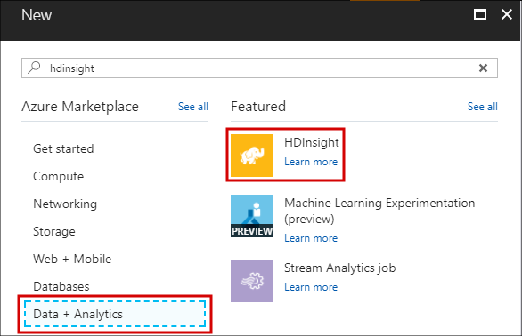
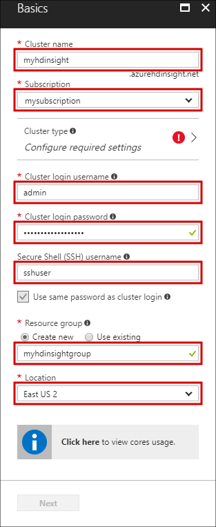
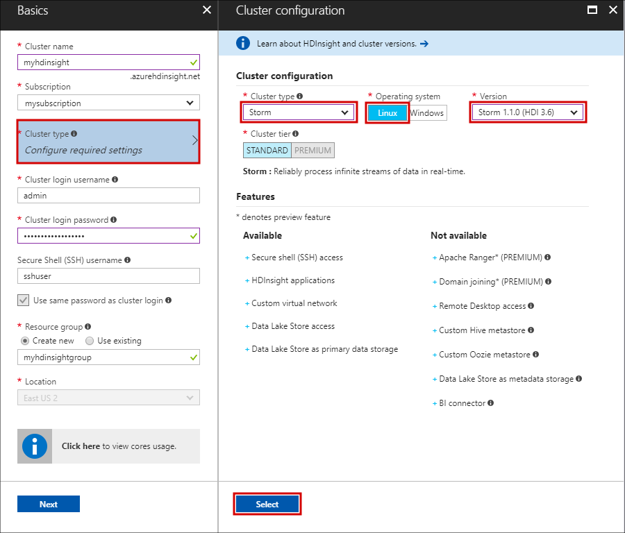
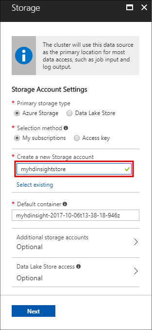
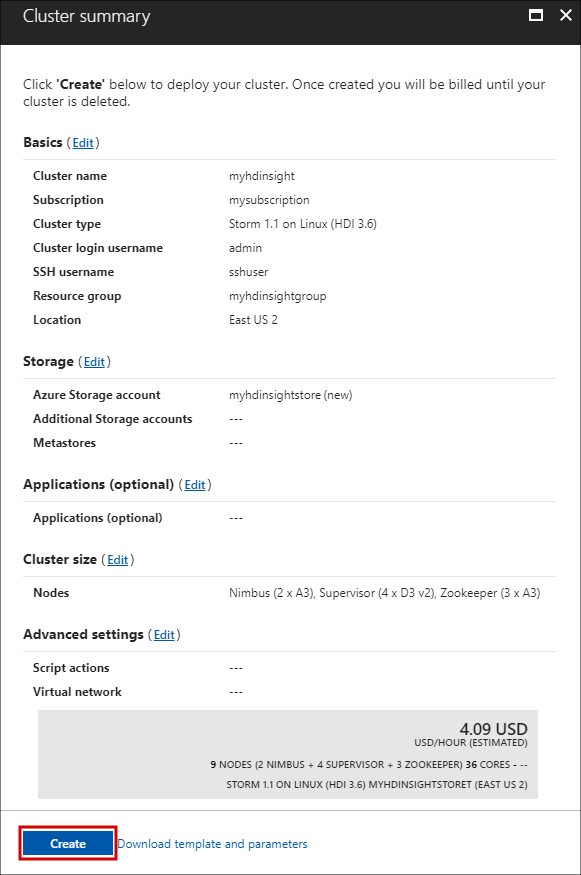

#Get started with Apache Storm on HDInsight using the storm-starter examples

Learn how to use Apache Storm in HDInsight using the storm-starter examples.

Apache Storm is a scalable, fault-tolerant, distributed, real-time computation system for processing streams of data. With Storm on Azure HDInsight, you can create a cloud-based Storm cluster that performs big data analytics in real time.

> [!IMPORTANT]
> Linux is the only operating system used on HDInsight version 3.4 or greater. For more information, see [HDInsight retirement on Windows](hdinsight-component-versioning.md#hdinsight-windows-retirement).

## Prerequisites

[!INCLUDE [delete-cluster-warning](../../includes/hdinsight-delete-cluster-warning.md)]

* **An Azure subscription**. See [Get Azure free trial](https://azure.microsoft.com/documentation/videos/get-azure-free-trial-for-testing-hadoop-in-hdinsight/).

* **Familiarity with SSH and SCP**. For information, see [Use SSH with HDInsight](hdinsight-hadoop-linux-use-ssh-unix.md).

## Create a Storm cluster

Use the following steps to create a Storm on HDInsight cluster:

1. From the [Azure portal](https://portal.azure.com), select **+ NEW**, **Data + Analytics**, and then select **HDInsight**.

    

2. From the **Basics** blade, enter the following information:

    * **Cluster Name**: The name of the HDInsight cluster.
    * **Subscription**: Select the subscription to use.
    * **Cluster login username** and **Cluster login password**: The login when accessing the cluster over HTTPS. You use these credentials to access services such as the Ambari Web UI or REST API.
    * **Secure Shell (SSH) username**: The login used when accessing the cluster over SSH. By default the password is the same as the cluster login password.
    * **Resource Group**: The resource group to create the cluster in.
    * **Location**: The Azure region to create the cluster in.

   

3. Select **Cluster type**, and then set the following values on the **Cluster configuration** blade:

    * **Cluster Type**: Storm

    * **Operating system**: Linux

    * **Version**: Storm 1.1.0 (HDI 3.6)

    * **Cluster Tier**: Standard

   Finally, use the **Select** button to save settings.

    

4. After selecting the cluster type, use the __Select__ button to set the cluster type. Next, use the __Next__ button to finish basic configuration.

5. From the **Storage** blade, select or create a Storage account. For the steps in this document, leave the other fields on this blade at the default values. Use the __Next__ button to save storage configuration.

    

6. From the **Summary** blade, review the configuration for the cluster. Use the __Edit__ links to change any settings that are incorrect. Finally, use the __Create__ button to create the cluster.

    

    > [!NOTE]
    > It can take up to 20 minutes to create the cluster.

## Run a storm-starter sample on HDInsight

1. Connect to the HDInsight cluster using SSH:

        ssh USERNAME@CLUSTERNAME-ssh.azurehdinsight.net

    > [!TIP]
    > Your SSH client may say that the authenticity of the host can't be established. If so, enter `yes` to continue.

    > [!NOTE]
    > If you used a password to secure your SSH user account, you are prompted to enter it. If you used a public key, you may need use the `-i` parameter to specify the matching private key. For example, `ssh -i ~/.ssh/id_rsa USERNAME@CLUSTERNAME-ssh.azurehdinsight.net`.

    For information, see [Use SSH with HDInsight](hdinsight-hadoop-linux-use-ssh-unix.md).

2. Use the following command to start an example topology:

        storm jar /usr/hdp/current/storm-client/contrib/storm-starter/storm-starter-topologies-*.jar org.apache.storm.starter.WordCountTopology wordcount

    > [!NOTE]
    > On previous versions of HDInsight, the class name of the topology is `storm.starter.WordCountTopology` instead of `org.apache.storm.starter.WordCountTopology`.

    This command starts the example WordCount topology on the cluster, with a friendly name of 'wordcount'. It randomly generates sentences and count the occurrence of each word in the sentences.

    > [!NOTE]
    > When submitting your own topologies to the cluster, you must first copy the jar file containing the cluster before using the `storm` command. Use the `scp` command to copy the file. For example, `scp FILENAME.jar USERNAME@CLUSTERNAME-ssh.azurehdinsight.net:FILENAME.jar`
    >
    > The WordCount example, and other storm-starter examples, are already included on your cluster at `/usr/hdp/current/storm-client/contrib/storm-starter/`.

If you are interested in viewing the source for the storm-starter examples, you can find the code at [https://github.com/apache/storm/tree/1.1.x-branch/examples/storm-starter](https://github.com/apache/storm/tree/1.1.x-branch/examples/storm-starter). This link is for Storm 1.1.x, which is provided with HDInsight 3.6. For other versions of Storm, use the __Branch__ button at the top of the page to select a different Storm version.

## Monitor the topology

The Storm UI provides a web interface for working with running topologies, and is included on your HDInsight cluster.

Use the following steps to monitor the topology using the Storm UI:

1. To display the Storm UI, open a web browser to `https://CLUSTERNAME.azurehdinsight.net/stormui`. Replace **CLUSTERNAME** with the name of your cluster.

    > [!NOTE]
    > If asked to provide a user name and password, enter the cluster administrator (admin) and password that you used when creating the cluster.

2. Under **Topology summary**, select the **wordcount** entry in the **Name** column. Information about the topology is displayed.

    

    This page provides the following information:

    * **Topology stats** - Basic information on the topology performance, organized into time windows.

        > [!NOTE]
        > Selecting a specific time window changes the time window for information displayed in other sections of the page.

    * **Spouts** - Basic information about spouts, including the last error returned by each spout.

    * **Bolts** - Basic information about bolts.

    * **Topology configuration** - Detailed information about the topology configuration.

    This page also provides actions that can be taken on the topology:

    * **Activate** - Resumes processing of a deactivated topology.

    * **Deactivate** - Pauses a running topology.

    * **Rebalance** - Adjusts the parallelism of the topology. You should rebalance running topologies after you have changed the number of nodes in the cluster. Rebalancing adjusts parallelism to compensate for the increased/decreased number of nodes in the cluster. For more information, see [Understanding the parallelism of a Storm topology](http://storm.apache.org/documentation/Understanding-the-parallelism-of-a-Storm-topology.html).

    * **Kill** - Terminates a Storm topology after the specified timeout.

3. From this page, select an entry from the **Spouts** or **Bolts** section. Information about the selected component is displayed.

    

    This page displays the following information:

    * **Spout/Bolt stats** - Basic information on the component performance, organized into time windows.

        > [!NOTE]
        > Selecting a specific time window changes the time window for information displayed in other sections of the page.

    * **Input stats** (bolt only) - Information on components that produce data consumed by the bolt.

    * **Output stats** - Information on data emitted by this bolt.

    * **Executors** - Information on instances of this component.

    * **Errors** - Errors produced by this component.

4. When viewing the details of a spout or bolt, select an entry from the **Port** column in the **Executors** section to view details for a specific instance of the component.

        2015-01-27 14:18:02 b.s.d.task [INFO] Emitting: split default ["with"]
        2015-01-27 14:18:02 b.s.d.task [INFO] Emitting: split default ["nature"]
        2015-01-27 14:18:02 b.s.d.executor [INFO] Processing received message source: split:21, stream: default, id: {}, [snow]
        2015-01-27 14:18:02 b.s.d.task [INFO] Emitting: count default [snow, 747293]
        2015-01-27 14:18:02 b.s.d.executor [INFO] Processing received message source: split:21, stream: default, id: {}, [white]
        2015-01-27 14:18:02 b.s.d.task [INFO] Emitting: count default [white, 747293]
        2015-01-27 14:18:02 b.s.d.executor [INFO] Processing received message source: split:21, stream: default, id: {}, [seven]
        2015-01-27 14:18:02 b.s.d.task [INFO] Emitting: count default [seven, 1493957]

    In this example, the word **seven** has occurred 1493957 times. This count is how many times the word has been encountered since this topology was started.

## Stop the topology

Return to the **Topology summary** page for the word-count topology, and then select the **Kill** button from the **Topology actions** section. When prompted, enter 10 for the seconds to wait before stopping the topology. After the timeout period, the topology no longer appears when you visit the **Storm UI** section of the dashboard.

## Delete the cluster

[!INCLUDE [delete-cluster-warning](../../includes/hdinsight-delete-cluster-warning.md)]

If you run into an issue with creating HDInsight cluster, see [access control requirements](hdinsight-administer-use-portal-linux.md#create-clusters).

## Next steps

In this Apache Storm tutorial, you learned the basics of working with Storm on HDInsight. Next, learn how to [Develop Java-based topologies using Maven](hdinsight-storm-develop-java-topology.md).

If you're already familiar with developing Java-based topologies and want to deploy an existing topology to HDInsight, see [Deploy and manage Apache Storm topologies on HDInsight](hdinsight-storm-deploy-monitor-topology-linux.md).

If you are a .NET developer, you can create C# or hybrid C#/Java topologies using Visual Studio. For more information, see [Develop C# topologies for Apache Storm on HDInsight using Hadoop tools for Visual Studio](hdinsight-storm-develop-csharp-visual-studio-topology.md).

For example topologies that can be used with Storm on HDInsight, see the following examples:

* [Example topologies for Storm on HDInsight](hdinsight-storm-example-topology.md)

[apachestorm]: https://storm.incubator.apache.org
[stormdocs]: http://storm.incubator.apache.org/documentation/Documentation.html
[stormstarter]: https://github.com/apache/storm/tree/master/examples/storm-starter
[stormjavadocs]: https://storm.incubator.apache.org/apidocs/
[hdinsight-provision]: hdinsight-hadoop-provision-linux-clusters.md
[preview-portal]: https://portal.azure.com/
