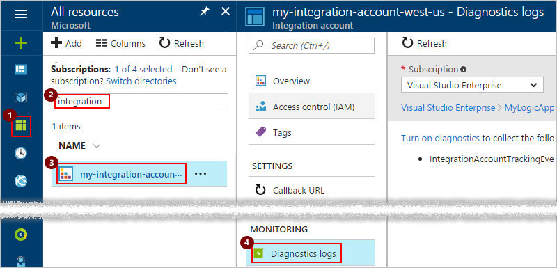
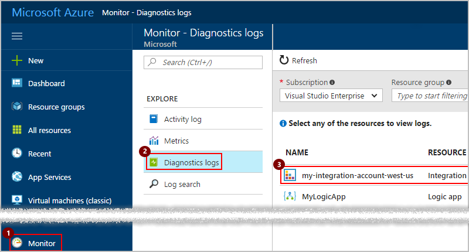
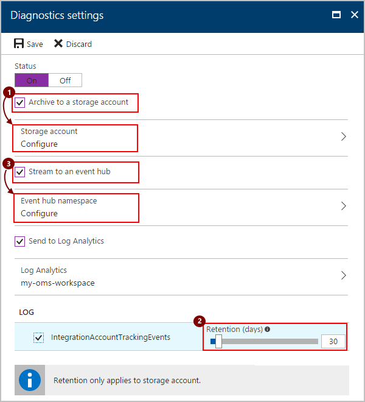

# Monitor and set up diagnostics logging for B2B communication in integration accounts

After you set up B2B communication between two running business 
processes or applications through your integration account, 
those entities can exchange messages with each other. 
To confirm this communication works as expected, 
you can set up monitoring for AS2, X12, and EDIFACT messages, 
along with diagnostics logging for your integration account 
through the [Azure Log Analytics](../log-analytics/log-analytics-overview.md) service. 
This service in [Operations Management Suite (OMS)](../operations-management-suite/operations-management-suite-overview.md) 
monitors your cloud and on-premises environments, 
helping you maintain their availability and performance, 
and also collects runtime details and events for richer debugging. 
You can also [use your diagnostic data with other services](#extend-diagnostic-data), 
like Azure Storage and Azure Event Hubs.

## Requirements

* A logic app that's set up with diagnostics logging. 
Learn [how to set up logging for that logic app](../logic-apps/logic-apps-monitor-your-logic-apps.md#azure-diagnostics).

  > [!NOTE]
  > After you've met this requirement, you should have a workspace in the 
  > [Operations Management Suite (OMS)](../operations-management-suite/operations-management-suite-overview.md). 
  > You should use the same OMS workspace 
  > when you set up logging for your integration account. 
  > If you don't have an OMS workspace, 
  > learn [how to create an OMS workspace](../log-analytics/log-analytics-get-started.md).

* An integration account that's linked to your logic app. Learn 
[how to create an integration account with a link to your logic app](../logic-apps/logic-apps-enterprise-integration-create-integration-account.md).

## Turn on diagnostics logging for your integration account

You can turn on logging either directly from your integration account 
or [through the Azure Monitor service](#azure-monitor-service). 
Azure Monitor provides basic monitoring with infrastructure-level data. 
Learn more about [Azure Monitor](../monitoring-and-diagnostics/monitoring-overview-azure-monitor.md).

### Turn on diagnostics logging directly from your integration account

1. In the [Azure portal](https://portal.azure.com), 
find and select your integration account. 
Under **Monitoring**, choose **Diagnostics logs** as shown here:

   

2. After you select your integration account, 
the following values are automatically selected. 
If these values are correct, choose **Turn on diagnostics**. 
Otherwise, select the values that you want:

   1. Under **Subscription**, select the Azure subscription 
   that you use with your integration account.
   2. Under **Resource group**, select the resource group that 
   you use with your integration account.
   3. Under **Resource type**, select **Integration accounts**. 
   4. Under **Resource**, select your integration account. 
   5. Choose **Turn on diagnostics**.

   

3. Under **Diagnostics settings**, and then **Status**, choose **On**.

   

4. Now select the OMS workspace and data to use for logging as shown:

   1. Select **Send to Log Analytics**. 
   2. Under **Log Analytics**, choose **Configure**. 
   3. Under **OMS Workspaces**, select the OMS workspace to use for logging.
   4. Under **Log**, select the **IntegrationAccountTrackingEvents** category.
   5. Choose **Save**.

   

5. Now [set up tracking for your B2B messages in OMS](../logic-apps/logic-apps-track-b2b-messages-omsportal.md).

### Turn on diagnostics logging through Azure Monitor

1. In the [Azure portal](https://portal.azure.com), 
on the main Azure menu, choose **Monitor**, **Diagnostics logs**. 
Then select your integration account as shown here:

   

2. After you select your integration account, 
the following values are automatically selected. 
If these values are correct, choose **Turn on diagnostics**. 
Otherwise, select the values that you want:

   1. Under **Subscription**, select the Azure subscription 
   that you use with your integration account.
   2. Under **Resource group**, select the resource group that 
   you use with your integration account.
   3. Under **Resource type**, select **Integration accounts**.
   4. Under **Resource**, select your integration account.
   5. Choose **Turn on diagnostics**.

   

3. Under **Diagnostics settings**, choose **On**.

   

4. Now select the OMS workspace and event category for logging as shown:

   1. Select **Send to Log Analytics**. 
   2. Under **Log Analytics**, choose **Configure**. 
   3. Under **OMS Workspaces**, select the OMS workspace 
   to use for logging.
   4. Under **Log**, select the **IntegrationAccountTrackingEvents** category.
   5. When you're done, choose **Save**.

   

5. Now [set up tracking for your B2B messages in OMS](../logic-apps/logic-apps-track-b2b-messages-omsportal.md).

## Extend how and where you use diagnostic data with other services

Along with Azure Log Analytics, you can extend how you use your logic app's 
diagnostic data with other Azure services, for example: 

* [Archive Azure Diagnostics Logs in Azure Storage](../monitoring-and-diagnostics/monitoring-archive-diagnostic-logs.md)
* [Stream Azure Diagnostics Logs to Azure Event Hubs](../monitoring-and-diagnostics/monitoring-stream-diagnostic-logs-to-event-hubs.md) 

You can then get real-time monitoring by using telemetry 
and analytics from other services, 
like [Azure Stream Analytics](../stream-analytics/stream-analytics-introduction.md) 
and [Power BI](../log-analytics/log-analytics-powerbi.md). For example:

* [Stream data from Event Hubs to Stream Analytics](../stream-analytics/stream-analytics-define-inputs.md)
* [Analyze streaming data with Stream Analytics and create a real-time analytics dashboard in Power BI](../stream-analytics/stream-analytics-power-bi-dashboard.md)

Based on the options that you want set up, make sure that you first 
[create an Azure storage account](../storage/common/storage-create-storage-account.md) 
or [create an Azure event hub](../event-hubs/event-hubs-create.md). 
Then select the options for where you want to send diagnostic data:

> [!NOTE]
> Retention periods apply only when you choose to use a storage account.

## Supported tracking schemas

Azure supports these tracking schema types, 
which all have fixed schemas except the Custom type.

* [AS2 tracking schema](../logic-apps/logic-apps-track-integration-account-as2-tracking-schemas.md)
* [X12 tracking schema](../logic-apps/logic-apps-track-integration-account-x12-tracking-schema.md)
* [Custom tracking schema](../logic-apps/logic-apps-track-integration-account-custom-tracking-schema.md)

## Next steps

* [Track B2B messages in OMS](../logic-apps/logic-apps-track-b2b-messages-omsportal.md "Track B2B messages in OMS")
* [Learn more about the Enterprise Integration Pack](../logic-apps/logic-apps-enterprise-integration-overview.md "Learn about Enterprise Integration Pack")

