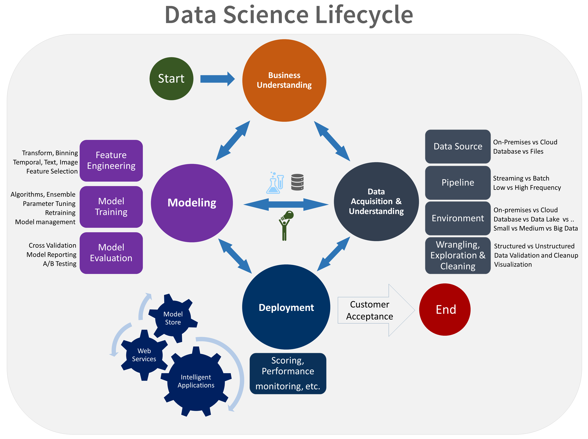

# Business understanding

This topic outlines the goals, tasks, and deliverables associated with the **business understanding stage** of the Team Data Science Process. This process provides a recommended lifecycle that you can use to structure your data science projects. The lifecycle outlines the major stages that projects typically execute, often iteratively:

* **Business Understanding**
* **Data Acquisition and Understanding**
* **Modeling**
* **Deployment**
* **Customer Acceptance**

Here is a visual representation of the **Team Data Science Process lifecycle**. 

 

## Goals
* The **key variables** are specified that are to serve as the **model targets** and whose related metrics are used determine the success for the project.
* The relevant **data sources** are identified that the business has access to or needs to obtain.

## How to do it
There are two main tasks addressed in this stage: 

* **Define Objectives**: Work with your customer and other stakeholders to understand and identify the business problems. Formulate questions that define the business goals and that data science techniques can target.
* **Identify data sources**: Find the relevant data that helps you answer the questions that define the objectives of the project.

### 1.1 Define objectives

1. A central objective of this step is to identify the key **business variables** that the analysis needs to predict. These variables are referred to as the **model targets** and the metrics associated with them are used to determine the success of the project. Two examples of such targets are sales forecast or the probability of an order being fraudulent.

2. Define the **project goals** by asking and refining "sharp" questions that are relevant and specific and unambiguous. Data science is the process of using names and numbers to answer such questions. For more information on asking sharp questions, see [How to do Data Science](https://blogs.technet.microsoft.com/machinelearning/2016/03/28/how-to-do-data-science/) blog. Data science / machine learning is typically used to answer five types of questions:
 
   * How much or how many? (regression)
   * Which category? (classification)
   * Which group? (clustering)
   * Is this weird? (anomaly detection)
   * Which option should be taken? (recommendation)

    Determine which of these questions you are asking and how answering it achieves your business goals.

3. Define the **project team** by specifying the roles and responsibilities of its members. Develop a high-level milestone plan that you iterate on as more information is discovered.  

4. **Define success metrics**. For example: Achieve customer churn prediction accuracy of X% by the end of this 3-month project, so that we can offer promotions to reduce churn. The metrics must be **SMART**: 
   * **S**pecific 
   * **M**easurable
   * **A**chievable 
   * **R**elevant 
   * **T**ime-bound 

### 1.2 Identify data sources
Identify data sources that contain known examples of answers to your sharp questions. Look for the following data:

* Data that is **Relevant** to the question. Do we have measures of the target and features that are related to the target?
* Data that is an **Accurate measure** of our model target and the features of interest.

It is not uncommon, for example, to find that existing systems need to collect and log additional kinds of data to address the problem and achieve the project goals. In this case, you may want to look for external data sources or update your systems to collect new data.

## Artifacts
Here are the deliverables in this stage:

* [**Charter Document**](https://github.com/Azure/Azure-TDSP-ProjectTemplate/blob/master/Docs/Project/Charter.md): A standard template is provided in the TDSP project structure definition. This is a living document that is updated throughout the project as new discoveries are made and as business requirements change. The key is to iterate upon this document, adding more detail, as you progress through the discovery process. Keep the customer and other stakeholders involved in making the changes and clearly communicate the reasons for the changes to them.  
* [**Data Sources**](https://github.com/Azure/Azure-TDSP-ProjectTemplate/blob/master/Docs/DataReport/Data%20Defintion.md#raw-data-sources): This is the **Raw Data Sources** section of the **Data Definitions** report that is found in the TDSP project **Data Report** folder. It specifies the original and destination locations for the raw data. In later stages, you fill in additional details like scripts to move the data to your analytic environment.  
* [**Data Dictionaries**](https://github.com/Azure/Azure-TDSP-ProjectTemplate/tree/master/Docs/DataDictionaries): This document provides descriptions of the data that is provided by the client. These descriptions include information about the schema (data types, information on validation rules, if any) and the entity-relation diagrams if available.

## Next steps

Here are links to each step in the lifecycle of the Team Data Science Process:

* [1. Business Understanding](lifecycle-business-understanding.md)
* [2. Data Acquisition and Understanding](lifecycle-data.md)
* [3. Modeling](lifecycle-modeling.md)
* [4. Deployment](lifecycle-deployment.md)
* [5. Customer Acceptance](lifecycle-acceptance.md)

Full end-to-end walkthroughs that demonstrate all the steps in the process for **specific scenarios** are also provided. They are listed and linked with thumbnail descriptions in the [Example walkthroughs](walkthroughs.md) topic. They illustrate how to combine cloud, on-premises tools, and services into a workflow or pipeline to create an intelligent application. 

For examples executing steps in the Team Data Science Process that use Azure Machine Learning Studio, see the [With Azure ML](http://aka.ms/datascienceprocess) learning path.