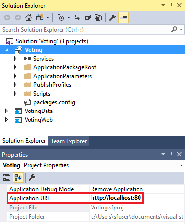
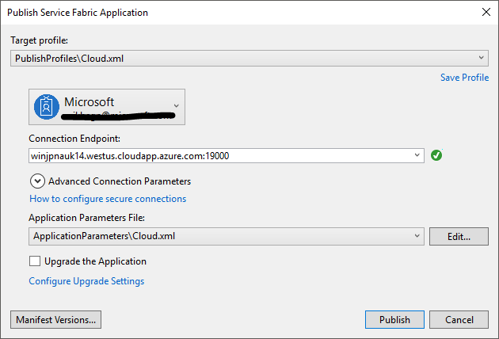
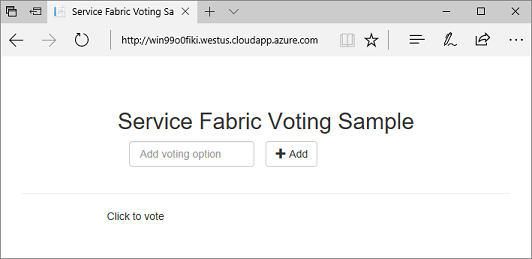
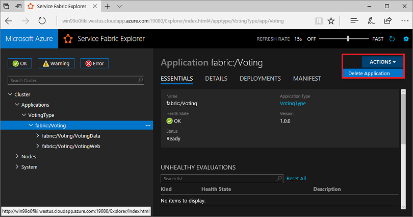
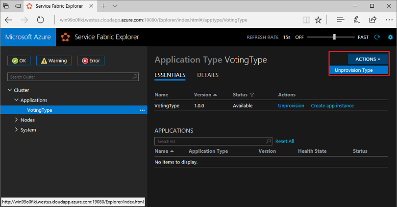

# Deploy an application to a Party Cluster in Azure
This tutorial is part two of a series and shows you how to deploy an Azure Service Fabric application to a Party Cluster in Azure.

In part two of the tutorial series, you learn how to:
> [!div class="checklist"]
> * Deploy an application to a remote cluster using Visual Studio
> * Remove an application from a cluster using Service Fabric Explorer

In this tutorial series you learn how to:
> [!div class="checklist"]
> * [Build a .NET Service Fabric application](service-fabric-tutorial-create-dotnet-app.md)
> * Deploy the application to a remote cluster
> * [Configure CI/CD using Visual Studio Team Services](service-fabric-tutorial-deploy-app-with-cicd-vsts.md)
> * [Set up monitoring and diagnostics for the application](service-fabric-tutorial-monitoring-aspnet.md)

## Prerequisites
Before you begin this tutorial:
- If you don't have an Azure subscription, create a [free account](https://azure.microsoft.com/free/?WT.mc_id=A261C142F)
- [Install Visual Studio 2017](https://www.visualstudio.com/) and install the **Azure development** and **ASP.NET and web development** workloads.
- [Install the Service Fabric SDK](service-fabric-get-started.md)

## Download the Voting sample application
If you did not build the Voting sample application in [part one of this tutorial series](service-fabric-tutorial-create-dotnet-app.md), you can download it. In a command window, run the following command to clone the sample app repository to your local machine.

```
git clone https://github.com/Azure-Samples/service-fabric-dotnet-quickstart
```

## Set up a Party Cluster
Party clusters are free, limited-time Service Fabric clusters hosted on Azure and run by the Service Fabric team where anyone can deploy applications and learn about the platform. For free!

To get access to a Party Cluster, browse to this site: http://aka.ms/tryservicefabric and follow the instructions to get access to a cluster. You need a Facebook or GitHub account to get access to a Party Cluster.

You can use your own cluster instead of the Party Cluster, if you want.  The ASP.NET core web front-end uses the reverse proxy to communicate with the stateful service back-end.  Party Clusters and the local development cluster have reverse proxy enabled by default.  If you deploy the Voting sample application to your own cluster, you must [enable the reverse proxy in the cluster](service-fabric-reverseproxy.md#setup-and-configuration).

> [!NOTE]
> Party clusters are not secured, so your applications and any data you put in them may be visible to others. Don't deploy anything you don't want others to see. Be sure to read over our Terms of Use for all the details.

## Configure the listening port
When the VotingWeb front-end service is created, Visual Studio randomly selects a port for the service to listen on.  The VotingWeb service acts as the front-end for this application and accepts external traffic, so let's bind that service to a fixed and well-know port. In Solution Explorer, open  *VotingWeb/PackageRoot/ServiceManifest.xml*.  Find the **Endpoint** resource in the **Resources** section and change the **Port** value to 80.

```xml
<Resources>
    <Endpoints>
      <!-- This endpoint is used by the communication listener to obtain the port on which to 
           listen. Please note that if your service is partitioned, this port is shared with 
           replicas of different partitions that are placed in your code. -->
      <Endpoint Protocol="http" Name="ServiceEndpoint" Type="Input" Port="80" />
    </Endpoints>
  </Resources>
```

Also update the Application URL property value in the Voting project so a web browser opens to the correct port when you debug using 'F5'.  In Solution Explorer, select the **Voting** project and update the **Application URL** property.



## Deploy the app to the Azure
Now that the application is ready, you can deploy it to the Party Cluster direct from Visual Studio.

1. Right-click **Voting** in the Solution Explorer and choose **Publish**.

    

2. Type in the Connection Endpoint of the Party Cluster in the **Connection Endpoint** field and click **Publish**.

    Once the publish has finished, you should be able to send a request to the application via a browser.

3. Open you preferred browser and type in the cluster address (the connection endpoint without the port information - for example, win1kw5649s.westus.cloudapp.azure.com).

    You should now see the same result as you saw when running the application locally.

    

## Remove the application from a cluster using Service Fabric Explorer
Service Fabric Explorer is a graphical user interface to explore and manage applications in a Service Fabric cluster.

To remove the application from the Party Cluster:

1. Browse to the Service Fabric Explorer, using the link provided by the Party Cluster sign-up page. For example, http://win1kw5649s.westus.cloudapp.azure.com:19080/Explorer/index.html.

2. In Service Fabric Explorer, navigate to the **fabric://Voting** node in the treeview on the left-hand side.

3. Click the **Action** button in the right-hand **Essentials** pane, and choose **Delete Application**. Confirm deleting the application instance, which removes the instance of our application running in the cluster.



## Remove the application type from a cluster using Service Fabric Explorer
Applications are deployed as application types in a Service Fabric cluster, which enables you to have multiple instances and versions of the application running within the cluster. After having removed the running instance of our application, we can also remove the type, to complete the cleanup of the deployment.

For more information about the application model in Service Fabric, see [Model an application in Service Fabric](service-fabric-application-model.md).

1. Navigate to the **VotingType** node in the treeview.

2. Click the **Action** button in the right-hand **Essentials** pane, and choose **Unprovision Type**. Confirm unprovisioning the application type.



This concludes the tutorial.

## Next steps
In this tutorial, you learned how to:

> [!div class="checklist"]
> * Deploy an application to a remote cluster using Visual Studio
> * Remove an application from a cluster using Service Fabric Explorer

Advance to the next tutorial:
> [!div class="nextstepaction"]
> [Set up continuous integration using Visual Studio Team Services](service-fabric-tutorial-deploy-app-with-cicd-vsts.md)