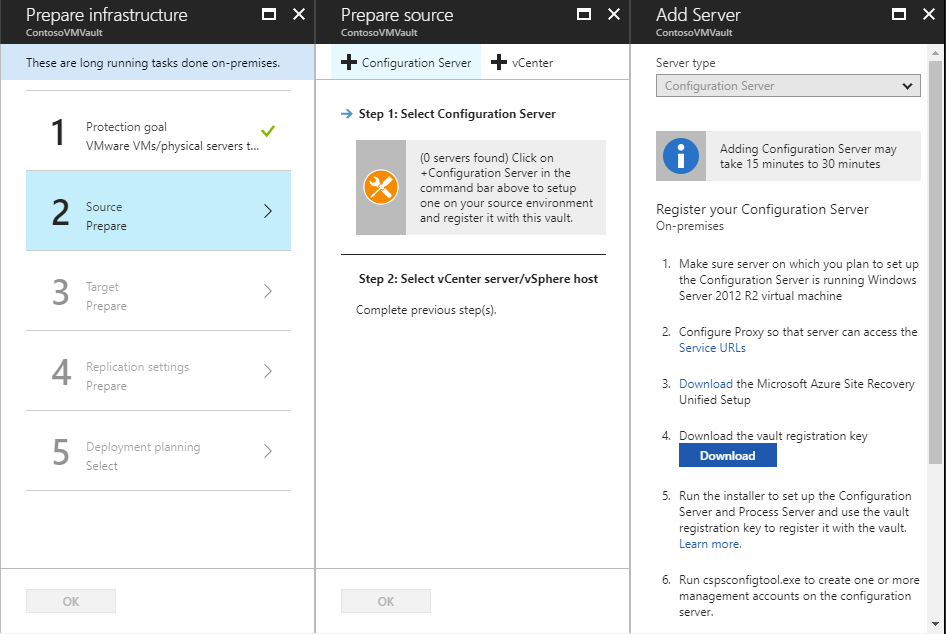
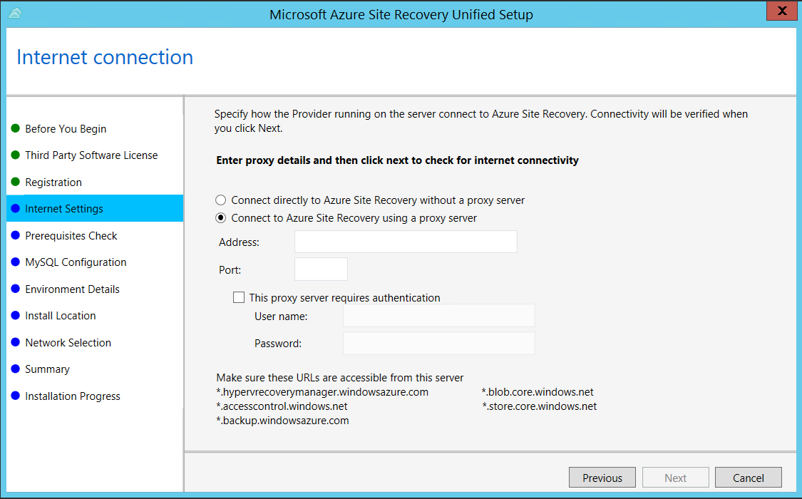
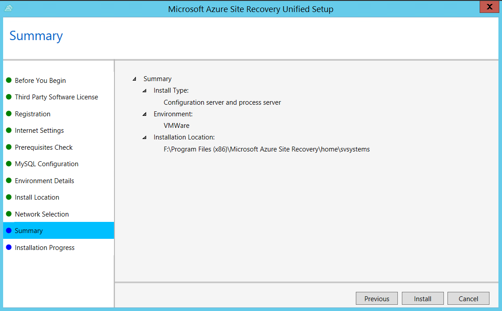

# Set up disaster recovery to Azure for on-premises VMware VMs

This tutorial shows you how to set up disaster recovery to Azure for on-premises VMware VM running
Windows. In this tutorial, you learn how to:

> [!div class="checklist"]
> * Create a Recovery Services vault for Site Recovery
> * Set up the source and target replication environments
> * Create a replication policy
> * Enable replication for a VM

This is the third tutorial in a series. This tutorial assumes that you have already completed the
tasks in the previous tutorials:

1. [Prepare Azure](tutorial-prepare-azure.md)
2. [Prepare on-premises VMware](tutorial-prepare-on-premises-vmware.md)

Before you start, it's helpful to [review the architecture](concepts-vmware-to-azure-architecture.md)
for disaster recovery scenario.

## Configure VMware account permissions

1. Create a role at the vCenter level. Give the role the name **Azure_Site_Recovery**.
2. Assign the following permissions to the **Azure_Site_Recovery** role.

   **Task** | **Role/Permissions** | **Details**
   --- | --- | ---
   **VM discovery** | Data Center object –> Propagate to Child Object, role=Read-only | At least a read-only user.   User assigned at datacenter level, and has access to all the objects in the datacenter.   To restrict access, assign the **No access** role with the **Propagate to child** object, to the child objects (vSphere hosts, datastores, VMs and networks).
   **Full replication, failover, failback** |  Data Center object –> Propagate to Child Object, role=Azure_Site_Recovery   Datastore -> Allocate space, browse datastore, low-level file operations, remove file, update virtual machine files   Network -> Network assign   Resource -> Assign VM to resource pool, migrate powered off VM, migrate powered on VM   Tasks -> Create task, update task   Virtual machine -> Configuration   Virtual machine -> Interact -> answer question, device connection, configure CD media, configure floppy media, power off, power on, VMware tools install   Virtual machine -> Inventory -> Create, register, unregister   Virtual machine -> Provisioning -> Allow virtual machine download, allow virtual machine files upload   Virtual machine -> Snapshots -> Remove snapshots | User assigned at datacenter level, and has access to all the objects in the datacenter.   To restrict access, assign the **No access** role with the **Propagate to child** object, to the child objects (vSphere hosts, datastores, VMs and networks).

3. Create a user on the vCenter server or vSphere host. Assign the role to the user.

## Specify what you want to replicate

The Mobility service must be installed on each VM you want to replicate. Site Recovery installs
this service automatically when you enable replication for the VM. For automatic installation, you
need to prepare an account that Site Recovery will use to access the VM.

You can use a domain or local account. For Linux VMs, the account should be root on the source Linux
server. For Windows VMs, if you're not using a domain account, disable Remote User Access control
on the local machine:

  - In the registery, under **HKEY_LOCAL_MACHINE\SOFTWARE\Microsoft\Windows\CurrentVersion\Policies\System**,
    add the DWORD entry **LocalAccountTokenFilterPolicy** and set the value to 1.

## Set up the source environment

Setting up the source environment consists of downloading the Site Recovery Unified Setup, setting
up the configuration server and registering it in the vault, and discovering VMs.

The configuration server is a single on-premises VMware VM to host all of the Site Recovery
components. This VM runs the configuration server, process server, and master target server.

- The configuration server coordinates communications between on-premises and Azure, and manages data
  replication.
- The process server acts as a replication gateway. Receives replication data, optimizes it with
  caching, compression, and encryption, and sends it to Azure storage. The process server also
  installs the Mobility service on VMs you want to replicate, and performs automatic discovery of VMs
  on on-premises VMware servers.
- The master target server handles replication data during failback from Azure.

The configuration server VM should be a highly available VMware VM that meets the following
requirements:

| **Requirement** | **Details** |
|-----------------|-------------|
| Number of CPU cores| 8 |
| RAM | 12 GB |
| Number of disks | 3 - OS disk, process server cache disk, retention drive (for failback) |
| Disk free space (process server cache) | 600 GB |
| Disk free space (retention disk) | 600 GB |
| Operating system version | Windows Server 2012 R2 |
| Operating system locale | English (en-us) |
| VMware vSphere PowerCLI version | [PowerCLI 6.0](https://my.vmware.com/web/vmware/details?productId=491&downloadGroup=PCLI600R1 "PowerCLI 6.0") |
| Windows Server roles | Don't enable these roles: Active Directory Domain Services, Internet Information Services, Hyper-V |
| NIC type | VMXNET3 |
| IP address type | Static |
| Ports | 443 (Control channel orchestration) 9443 (Data transport)|

On the configuration server VM, make sure that the system clock is synchronized with a Time Server.
Time must be synchronized to within 15 minutes. If the time difference is greater than 15 minutes,
setup fails.

Make sure the configuration server VM can access these URLs:

- *.accesscontrol.windows.net. Used for access control and identity management.
- *.backup.windowsazure.com. Used for replication data transfer and coordination.
- *.blob.core.windows.net. Used for access to the storage account that stores replicated data.
- *.hypervrecoverymanager.windowsazure.com. Used for replication management operations and coordination.
- time.nist.gov and time.windows.com. Used to check time synchronization between system and global time.

URLs for the Azure Government cloud:

- *.ugv.hypervrecoverymanager.windowsazure.us
- *.ugv.backup.windowsazure.us
- *.ugi.hypervrecoverymanager.windowsazure.us
- *.ugi.backup.windowsazure.us

Any IP address-based firewall rules should allow communication to [Azure Datacenter IP
Ranges](https://www.microsoft.com/download/confirmation.aspx?id=41653), and ports 443 (HTTPS) and
9443 (data replication). Be sure to allow IP address ranges for the Azure region of your
subscription, and for West US (used for Access Control and Identity Management).

### Download the Site Recovery Unified Setup

1. Open the [Azure portal](https://portal.azure.com) and click on **All resources**.
2. Click on the Recovery Service vault named **ContosoVMVault**.
3. Click **Site Recovery** > **Prepare Infrastructure** > **Protection goal**.
4. Select **On-premises** for where your machines are located, **To Azure** for where you want to
   replicate your machines, and **Yes, with VMware vSphere Hypervisor**. Then, click **OK**.
5. In the Prepare source pane, click **+Configuration server**.
6. In **Add Server**, check that **Configuration Server** appears in **Server type**.
7. Download the Site Recovery Unified Setup installation file.
8. Download the vault registration key. You need this when you run Unified Setup. The key is valid
   for five days after you generate it.

   

### Set up the configuration server

1. Run the Unified Setup installation file.
2. In **Before You Begin**, select **Install the configuration server and process server** then click **Next**.

3. In **Third Party Software License**, click **I Accept** to download and install MySQL, then click **Next**.

4. In **Registration**, select the registration key you downloaded from the vault.

5. In **Internet Settings**, specify how the Provider running on the configuration server connects
   to Azure Site Recovery over the Internet.

   - If you want to connect with the proxy that's currently set up on the machine, select **Connect
     to Azure Site Recovery using a proxy server**.
   - If you want the Provider to connect directly, select **Connect directly to Azure Site Recovery
     without a proxy server**.
   - If the existing proxy requires authentication, or if you want to use a custom proxy for the
     Provider connection, select **Connect with custom proxy settings**, and specify the address,
     port, and credentials.

   

6. In **Prerequisites Check**, Setup runs a check to make sure that installation can run. If a
   warning appears about the **Global time sync check**, verify that the time on the system clock
   (**Date and Time** settings) is the same as the time zone.

   

7. In **MySQL Configuration**, create credentials for logging on to the MySQL server instance that
   is installed.

8. In **Environment Details**, select **Yes** to protect VMware VMs. Setup checks that PowerCLI 6.0
   is installed.

9. In **Install Location**, select where you want to install the binaries and store the cache. The
   drive you select must have at least 5 GB of disk space available, but we recommend a cache drive
   with at least 600 GB of free space.

10. In **Network Selection**, specify the listener (network adapter and SSL port) on which the
    configuration server sends and receives replication data. Port 9443 is the default port used
    for sending and receiving replication traffic, but you can modify this port number to suit your
    environment's requirements. We also open port 443, which is used to orchestrate replication
    operations. Do not use port 443 for sending or receiving replication traffic.

11. In **Summary**, review the information and click **Install**. Setup
    installs the configuration server and registers with it the Azure Site Recovery service.

    

    When installation finishes, a passphrase is generated. You will need this when you enable
    replication, so copy it and keep it in a secure location. The server is displayed on the
    **Settings** > **Servers** pane in the vault.

### Configure automatic discovery

To discover VMs, the configuration server needs to connect to on-premises VMware servers. For the
purposes of this tutorial, add the vCenter server, or vSphere hosts, using an account that has
administrator privileges on the server.

1. On your configuration server, launch **CSPSConfigtool.exe**. It is available as a shortcut on the
   desktop and located in the *install location*\home\svsystems\bin folder.

2. Click **Manage Accounts** > **Add Account**.

   

3. In **Account Details**, add the account that will be used for automatic discovery.

   

To add a server:

1. Open the [Azure portal](https://portal.azure.com) and click on **All resources**.
2. Click on the Recovery Service vault named **ContosoVMVault**.
3. Click **Site Recovery** > **Prepare Infrastructure** > **Source**
4. Select **+vCenter** to connect to a vCenter server or vSphere ESXi host.
5. In **Add vCenter**, specify a friendly name for the server. Then, specify the IP address or FQDN.
6. Leave the port set to 443, unless your VMware servers listen for requests on a different port.
7. Select the account to use for connecting to the server. Click **OK**.

Site Recovery connects to VMware servers using the specified settings, and discovers VMs.

> [!NOTE]
> It can take 15 minutes or more for the account name to appear in the portal. To update
> immediately, click **Configuration Servers** > ***server name*** > **Refresh Server**.

## Set up the target environment

Select and verify target resources.

1. Click **Prepare infrastructure** > **Target**, and select the Azure subscription you want to use.
2. Specify whether your target deployment model is Resource Manager-based, or classic.
3. Site Recovery checks that you have one or more compatible Azure storage accounts and networks.

   

## Create a replication policy

1. Open the [Azure portal](https://portal.azure.com) and click on **All resources**.
2. Click on the Recovery Service vault named **ContosoVMVault**.
3. To create a replication policy, click **Site Recovery infrastructure** > **Replication
   Policies** > **+Replication Policy**.
4. In **Create replication policy**, specify a policy name **VMwareRepPolicy**.
5. In **RPO threshold**, use the default of 60 minutes. This value defines how often recovery
   points are created. An alert is generated if continuous replication exceeds this limit.
6. In **Recovery point retention**, use the default of 24 hours for how long the retention window
   is for each recovery point. For this tutorial we select 72 hours. Replicated VMs can be
   recovered to any point in a window.
7. In **App-consistent snapshot frequency**, use the default of 60 minutes for the frequency that
   application-consistent snapshots are created. Click **OK** to create the policy.

   

The policy is automatically associated with the configuration server. By default, a matching policy
is automatically created for failback. For example, if the replication policy is **rep-policy**
then the failback policy will be **rep-policy-failback**. This policy isn't used until you initiate
a failback from Azure.

## Enable replication

Site Recovery installs the Mobility service when replication is enabled for a VM. It can take 15
minutes or longer for changes to take effect and appear in the portal.

Enable replication as follows:

1. Click **Replicate application** > **Source**.
2. In **Source**, select the configuration server.
3. In **Machine type**, select **Virtual Machines**.
4. In **vCenter/vSphere Hypervisor**, select the vCenter server that manages the vSphere host, or
   select the host.
5. Select the process server (configuration server). IThen click **OK**.
6. In **Target**, select the subscription and the resource group in which you want to create the
   failed over VMs. Choose the deployment model that you want to use in Azure (classic or resource
   management), for the failed over VMs.
7. Select the Azure storage account you want to use for replicating data.
8. Select the Azure network and subnet to which Azure VMs will connect, when they're created after
   failover.
9. Select **Configure now for selected machines**, to apply the network setting to all machines you
   select for protection. Select **Configure later** to select the Azure network per machine.
10. In **Virtual Machines** > **Select virtual machines**, click and select each machine you want
    to replicate. You can only select machines for which replication can be enabled. Then click **OK**.
11. In **Properties** > **Configure properties**, select the account that will be used by the
    process server to automatically install the Mobility service on the machine.
12. In **Replication settings** > **Configure replication settings**, verify that the correct
    replication policy is selected.
13. Click **Enable Replication**.

You can track progress of the **Enable Protection** job in **Settings** > **Jobs** > **Site
Recovery Jobs**. After the **Finalize Protection** job runs the machine is ready for failover.

To monitor VMs you add, you can check the last discovered time for VMs in **Configuration Servers**
> **Last Contact At**. To add VMs without waiting for the scheduled discovery, highlight the
configuration server (don’t click it), and click **Refresh**.

## Next steps

> [!div class="nextstepaction"]
> [Run a disaster recovery drill](site-recovery-test-failover-to-azure.md)
