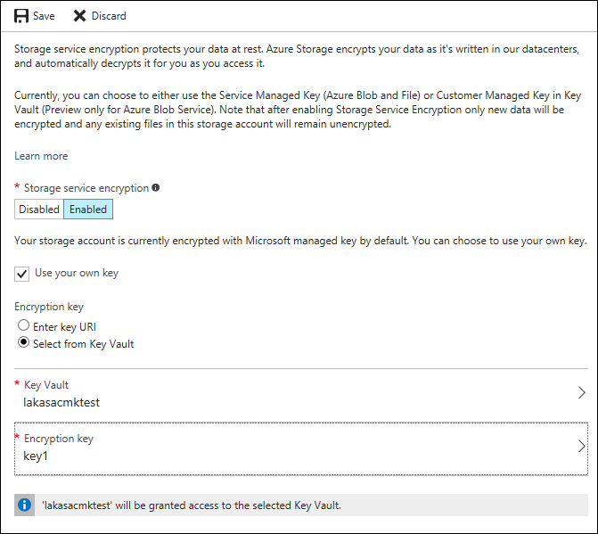
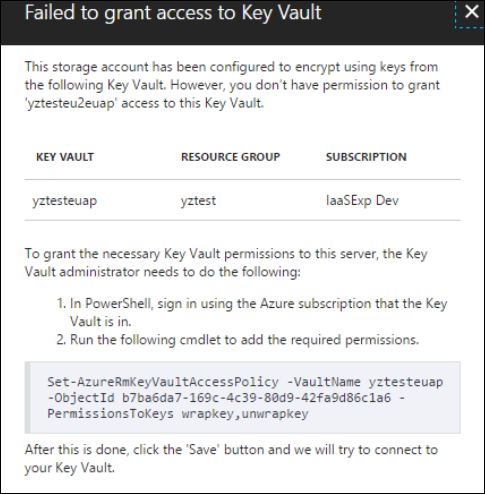

# Storage Service Encryption using customer managed keys in Azure Key Vault

Microsoft Azure is committed to helping you protect and safeguard your data to meet your organizational security and compliance commitments.  One way you can protect your data at rest is to use Storage Service Encryption (SSE), which automatically encrypts your data when writing it to storage, and decrypts your data when retrieving it. The encryption and decryption is automatic, completely transparent, and uses 256-bit [AES encryption](https://en.wikipedia.org/wiki/Advanced_Encryption_Standard), one of the strongest block ciphers available.

You can use Microsoft-managed encryption keys with SSE or you can use your own encryption keys. This article discusses the latter. For more information about using Microsoft-managed keys, or about SSE in general, see [Storage Service Encryption for Data at Rest](../storage-service-encryption.md).

To provide the ability to use your own encryption keys, SSE for Blob storage is integrated with Azure Key Vault (AKV). You can create your own encryption keys and store them in AKV, or you can use AKV’s APIs to generate encryption keys. Not only does AKV allow you to manage and control your keys, it also enables you to audit your key usage. 

Why would you want to create your own keys? It gives you more flexibility, allowing you to create, rotate, disable, and define access controls. It also allows you to audit the encryption keys used to protect your data.

## SSE with customer managed keys preview

This feature is currently in preview. To use this feature, you need to create a new storage account. You can either create a new key vault and key or you can use an existing key vault and key. The storage account and the key vault must be in the same region, but they can be in different subscriptions.

To participate in the preview, contact [ssediscussions@microsoft.com](mailto:ssediscussions@microsoft.com). We will provide a special link to participate in the preview.

To learn more, refer to the [FAQ](#frequently-asked-questions-about-storage-service-encryption-for-data-at-rest).

> [!IMPORTANT]
> You must sign up for the preview prior to following the steps in this article. Without preview access, you will not be able to enable this feature in the portal.

## Getting Started
## Step 1: [Create a new storage account](../storage-create-storage-account.md)

## Step 2: Enable encryption
You can enable SSE for the storage account using the [Azure portal](https://portal.azure.com). On the Settings blade for the storage account, look for the Blob Service section as shown in the following figure and click Encryption.

 *Enable SSE for Blob Service*

If you want to programmatically enable or disable the Storage Service Encryption on a storage account, you can use the [Azure Storage Resource Provider REST API](https://docs.microsoft.com/en-us/rest/api/storagerp/?redirectedfrom=MSDN), the [Storage Resource Provider Client Library for .NET](https://docs.microsoft.com/en-us/dotnet/api/?redirectedfrom=MSDN), [Azure PowerShell](https://docs.microsoft.com/en-us/powershell/azure/overview?view=azurermps-4.0.0), or the [Azure CLI](https://docs.microsoft.com/en-us/azure/storage/storage-azure-cli).

On this screen, if you can’t see the “use your own key” checkbox, you have not been approved for the preview. Send an e-mail to [ssediscussions@microsoft.com](mailto:ssediscussions@microsoft.com) and request approval.

By default, SSE uses Microsoft managed keys. To use your own keys, check the box. Then you can either specify your key URI, or select a key and Key Vault from the picker.

## Step 3: Select your key

If the storage account does not have access to the Key Vault, you can run the following command using Azure Powershell to grant access to the storage accounts to the required key vault.

You can also grant access via the Azure portal by going to the Azure Key Vault in the Azure portal and granting access to the storage account.

## Step 4: Copy data to storage account
If you would like to transfer data into your new storage account so that it’s encrypted, refer to [Step 3 of Getting Started in Storage Service Encryption for Data at Rest](https://docs.microsoft.com/en-us/azure/storage/storage-service-encryption#step-3-copy-data-to-storage-account).

## Step 5: Query the status of the encrypted data
To query the status of the encrypted data, refer to [Step 4 of Getting Started in Storage Service Encryption for Data at Rest](https://docs.microsoft.com/en-us/azure/storage/storage-service-encryption#step-4-query-the-status-of-the-encrypted-data).

## Frequently asked questions about Storage Service Encryption for Data at Rest
**Q: I'm using Premium storage; can I use SSE with customer managed keys?**

A: Yes, SSE with Microsoft-managed  and customer managed keys is supported on both Standard storage and Premium storage. 

**Q: Can I create new storage accounts with SSE with customer managed keys enabled using Azure PowerShell and Azure CLI?**

A: Yes.

**Q: How much more does Azure Storage cost if SSE with customer managed keys is enabled?**

A: There is a cost associated for using Azure Key Vault. For more details visit [Key Vault Pricing](https://azure.microsoft.com/en-us/pricing/details/key-vault/). There is no additional cost for using SSE.

**Q: Can I revoke access to the encryption keys?**

A: Yes, you can revoke access at any time. There are several ways to revoke access to your keys. Refer to [Azure Key Vault PowerShell](https://docs.microsoft.com/en-us/powershell/module/azurerm.keyvault/?view=azurermps-4.0.0) and [Azure Key Vault CLI](https://docs.microsoft.com/en-us/cli/azure/keyvault) for more details. Revoking access will effectively block access to all blobs in the storage account as the Account Encryption Key is inaccessible by Azure Storage.

**Q: Can I create a storage account and key in different region?**

A: No, the storage account and key vault/key need to be in the same region. 

**Q: Can I enable SSE with customer managed keys while creating the storage account?**

A: No. When you enable SSE while creating the storage account, you can only use Microsoft managed keys. If you would like to use customer managed keys, you must update the storage account properties. You can use REST or one of the storage client libraries to programmatically update your storage account, or update the storage account properties using the Azure portal after creating the account.

**Q: Can I disable encryption while using SSE with customer managed keys?**

A: No, you cannot disable encryption while using SSE with customer managed keys. To disable encryption, you must switch to using Microsoft managed keys. You can do this using either the Azure portal or PowerShell.

**Q: Is SSE enabled by default when I create a new storage account?**

A: SSE is not enabled by default; you can use the Azure portal to enable it. You can also programmatically enable this feature using the Storage Resource Provider REST API. 

**Q: I can't enable encryption on my storage account.**

A: Is it a Resource Manager storage account? Classic storage accounts are not supported. SSE with customer managed keys can also be enabled only on newly created Resource Manager storage accounts.

**Q: Is SSE with customer managed keys only permitted in specific regions?**

A: SSE is available in only certain regions for Blob storage for this Preview. Email [ssediscussions@microsoft.com](mailto:ssediscussions@microsoft.com) to check for availability and details on preview. 

**Q: How do I contact someone if I have any issues or want to provide feedback?**

A: Contact [ssediscussions@microsoft.com](mailto:ssediscussions@microsoft.com) for any issues related to Storage Service Encryption. 

## Next steps

*	For more information on the comprehensive set of security capabilities that help developers build secure applications, see the [Storage Security Guide](https://docs.microsoft.com/en-us/azure/storage/storage-security-guide).
*	For overview information about Azure Key Vault, see [What is Azure Key Vault](https://docs.microsoft.com/en-us/azure/key-vault/key-vault-whatis)?
*	For getting started on Azure Key Vault, see [Getting Started with Azure Key Vault](../../key-vault/key-vault-get-started.md).
